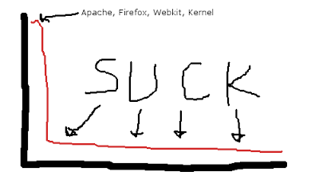

## June
### Rants heard 'round the community, ver 2

[//p20]: # (https://web.archive.org/web/20171013020641/http://linuxhaters.blogspot.com/2008/06/rants-heard-round-community-ver-2.html)

*Posted Monday, June 2, 2008 @ 2:32 PM. 21 FLAMES*

Ok, this time not so ranty, but this guy's just being political with his hate.
If he spent as many hours in front of his PC writing this as I think he did,
then he's got to have some hate in him.

[Why linux may fail on the desktop (Jonathan Birge)][20]

[20]: http://scripts.mit.edu/~birge/blog/why-linux-may-fail-on-the-desktop/

### And sometimes they're just lunatics

[//p21]: # (https://web.archive.org/web/20171013021907/http://linuxhaters.blogspot.com/2008/06/and-sometimes-theyre-just-lunatics.html)

*Posted Monday, June 2, 2008 @ 2:49 PM. 24 FLAMES*

The problem with the internet, really, is that it lets lunatics connect with
each other and get organized (in whatever manner appropriate for lunatics). As
if drum circles weren't enough, now they have websites that can attract others
with weak minds and recruit them to their "cause", for the internet reaches
much farther than the sound of beating drums.

Want an example? [Boycott Novell][21]!

[21]: http://boycottnovell.com/2008/02/15/mono-contamination-in-ubuntu/

Among the many asinine statements on this page, I'd like to chew on just a few.

> One thing I noticed this week is that the mono group has been able to
> encumber a growing number of Ubuntu (not Kubuntu) applications with
> proprietary Microsoft technology. However, the documentation and program
> descriptions do not warn of this (of course they want to keep it under the
> radar).

Yes, Mono dudes are hacking their life away just to *infect* your system with a
modern development environment. Maybe they should put their keyboards down and
come stick you with an AIDS needle instead? Try apt-get remove'ing that shit.

Then it goes on to talk about how many packages on Ubuntu depend on Mono:

> dapper 159 ?  
> gutsy 150 ?  
> hardy 176 ?

(Not sure what the question marks are about. Maybe he was unsure of his
manhood?) Anyhow, lets not forget the fact that Debian based distros like to
break every package into every imaginable sub-component, so that users can
recombine these pieces to realize infinite custom configurations which all
don't work. Freedom Baby! But anyways, point is, your numbers are slightly
inflated there. But nevermind that.

Let's continue,

> A risk here is that, especially in regards to media (audio, video, pictures,
> text, etc.) it will provide a ramp for OOXML, WMA, WMV, HDPhoto, and others
> along with the prerequiste DRM. I would expect that if Micrsooft makes
> further contracts with Novell or other turncoats, that this will soon start
> to cover DRM.

Yea because, you know, just because Novell decides the write the code, *you
have to use it*. Maybe [RMS was right][22] about the whole software being a
drug thing, except it applies to free software. I mean, it's free, so you
*must* use it.

[22]: http://linuxhaters.blogspot.com/2008/05/jay-z-betta-step-off-billy-g-is-new.html

Oh wait, isn't that what this whole GPL thing is about? Doesn't it say
somewhere in there that you can take someone else's code and modify it how you
want so that you can take out all the things you think are going to kill you
and use it to continue to live in your freedom bubble?

Nevermind that Novell is trying to put features in to Linux that *people
actually want*. Features that *solve people's problems*.

Anyways, going back to my first point, the worst part of all of this is that
people read your shit, and [take it to the next level][23].

[23]: http://mail.gnome.org/archives/desktop-devel-list/2008-February/msg00129.html

I'm sorry, I have to quote this one in it's entirety, because it's too good.

> I've just started a replacement for Tomboy. I think it (or another notes
> program if there already is one) should replace Tomboy ASAP in the GNOME
> desktop because Tomboy is poisoning GNOME distributions like Red Hat and
> Ubuntu with it's Microsoft patented MONO dependency crap as you can read
> about on http://boycottnovell.com/2008/02/15/mono-contamination-in-ubuntu/
> 
> I've never written a program before so I also need some help. Also I need a
> place to put it on the web.
> 
> I've already gotten it so you can type stuff in a text field, so it already
> almost has all the functionality you need in a note taking program.
> 
> Thanks,

Yes, Thanks indeed for that.

### Now that waterboarding is illegal, lets make 'em read Linux planets

[//p22]: # (https://web.archive.org/web/20171012211830/http://linuxhaters.blogspot.com/2008/06/now-that-waterboarding-is-illegal-lets.html)

*Posted Monday, June 2, 2008 @ 6:51 PM. 27 FLAMES*

What's the best way to keep up with the Linux technology?

Here are my options:

* Endure Slashdot or [Linux Reddit][24]
* Atone for all my humanly sins by reading [OSNews.com][25]
* Pay LWN.net to read stuff that I can read in a week or find on my own.
* Gank my friend's LWN account.
* Do nothing, and wait for the next Ubuntu to break my box.
* Subscribe to 300 mailing lists and process 30000 messages a day. 80% of which
  are along the lines of "Hey, I'm trying to run Linux on my wife's dildo, but
  I can't seem to get it to wake from ACPI sleep"
* Read planets

[24]: http://reddit.com/r/linux
[25]: http://www.osnews.com/

Let me focus on that last one. Cuz you know, Linux is a community thing right?

Every Linux drone that tried subscribing to planet feeds, and I'm sure 99% of
then unsubscribed less than an hour later, because they'd rather look at [Linus
porn][26]. When I think about it really *really* hard, I realize that
hand-in-hand with my interest of Gnome also comes my interest in the boring
lives of all the developers, like the [matchstick trains they make][27], or
[their pan-handling][28] (i.e. their pathetic "business plan" to make money
from free software), or [grotesque photos of their family][29]. Please write
more about how you ate a rotten burrito and it gave you diarrhea but somehow
shitting all over your keyboard fixed a bug in some useless feature that you're
adding to libfuck which will break it's ABI. Cuz I want to know. Knowing you
suffered physically will make me feel a little bit better.

[26]: http://flickr.com/photos/pfenwick/2229585929/
[27]: http://feeds.feedburner.com/~r/drboblog/~3/303138474/
[28]: http://www.cimitan.com/blog/2008/06/02/donations-i-need-some-money-for-a-wifi-usb-stick/
[29]: http://davyd.livejournal.com/251276.html

Besides, I don't want to expose myself to [unsavory language][30].

[30]: http://www.beatniksoftware.com/blog/?p=94#comment-39666

If you want to find out about cool new innovative products and technologies? go
read blogs by people who build technology for a living. You know, those people
who actually make products that people are willing to pay for? Interestingly,
those same people don't seem to feel the need to tell everyone about their
dreary lives.

### I've used Linux since before Linus was born, ok?

[//p23]: # (https://web.archive.org/web/20171012210944/http://linuxhaters.blogspot.com/2008/06/ive-used-linux-since-before-linus-was.html)

*Posted Tuesday, June 3, 2008 @ 11:34 AM. 48 FLAMES*

Sweet. I was getting kinda lonely hating all by myself. But Mr. Graveley of
Gnome fame [gave me a shoutout][31]. +1 for you dude. But am I the only one that
detected the sarcastic tone in his post? I guess planet gnome isn't the place
for humor eh?

[31]: http://www.beatniksoftware.com/blog/?p=94

Moving on.

Occasionally I see posts from random lusers on the internet who say shit like,
"Yea, I know what I'm talking about because I've used Linux since 0.99 days."

Awesome dude. You've been using an OS that doesn't matter for almost 15 years.
Meanwhile, others have been getting stuff done, fixing real problems for real
people *and* getting paid.

Not only that, you've been using a system where the developers like to replace
every subsystem every few years. So even if you made a contribution back then,
it's probably gone now. Even if you were a 3l33t h4xx0r back then, you're a
born-again newb every 6 months. Even if you learned how to configure your
30-way software raid (15 over LVM and 15 over EVMS) with redundant HAM radio
and and a taser hooked up to xbiff so that you KNOW when you have mail so that
you can annoy one of your acquaintances (I feel sorry for them, really) with an
assfaced reply about how they should send their attachment in PDF. Fuck, I even
spent way too long this morning trying to figure out how the X vnc module's
setup changed between Gutsy and Hardy, only soon later to realize that now it's
totally unstable and should not have been shipped at all.

    assert(RandomChange != Progress);

**edit**: Oooh, I've been corrected apparently (see comments). Don't start with
me about Google OK? Google took a fringe OS, and then put a fuckton of work and
money into it to make it the base of a world-class infrastructure. And where
are the changes? Clearly, with Google's lead, they have no incentive to give
the changes back, and the license doesn't require them to. So a bunch of dudes
got paid to hack Linux up to make something work for them, and that's supposed
to make me feel better about my laptop not waking up from sleep?

At best, Linux on the server has mattered for the two most recent years. What
about the other 13?

### Good software isn't really free

[//p24]: # (https://web.archive.org/web/20171216112218/http://linuxhaters.blogspot.com:80/2008/06/good-software-isnt-really-free.html)

*Posted Tuesday, June 3, 2008 @ 4:41 PM. 166 FLAMES*

Please, please, stop telling me or others that the success of OSS is easily
demostrated by projects like Webkit, and the kernel, and Firefox, and apache.

If you're going to talk that drivel, at least be more specific. There are two
kinds of OSS projects: First, there's the "I made this!" type. These projects
often have assfuck users going around telling everyone how this project is
better than everything else, and how every distro should replace some other
working program with their new shit.

And then there's the "I have a workable business model" type. These are the
ones you've probably heard of. The ones you raise as examples, as if somehow
they represent how all open source projects could one day be successful. Quite
not so coincidentally, these often (kernel excepted of course) also happen to
run on Windows or other commercial OSes, which users actually use.

Projects like the kernel and firefox are *exceptions* in a sea full of shitty
projects. They are how open source projects *should* be run. They've figured
out how to create value that people will pay for. They have paid people working
on them, producing valuable code, solving real problems, and are usually
shipped in usable, tested ways.

Rarely, and I mean *rarely* (i.e. hard enough to find that it's not worth
trying out 3000 different apt-get installs for programs that do the same
thing), you find a project that has a really good developer writing really good
code, but it's not backed by a sustainable model. These projects get far enough
to get included on most distros (mostly feuled by ego), but then die, because
the developer wakes the fuck up and realizes he should be getting paid, or some
company comes along and snatches him up. I've come to hate using this kind of
software, because I usually like it at first, but then I know that eventually
it's going to shit (Ideally, you can continue to use the old version, but
everybody who's tried this knows that doesn't work for long, but I'll save that
for another rant).

For those textually impaired:

{width=400px}\

This is the so-called long tail of OSS software. Study it well. And stop being
delusional and acting like *all* of it is hot shit. The good stuff is what the
smart guys with good business models get paid to work on. The vast majority of
the rest is crap. Not too unlike commercial softare you say? No shit. It's been
happening for years.

BTW, I made that beautiful image using Gimp, one of your great tools. Too bad
after 10 minutes of reading a bunch of tooltips and the help of a linux expert
friend, we still couldn't figure out a straightforward way to draw a straight
line. But who needs straight lines right?

I finally found it by [googling it][32]. You hold shift. Try doing it yourself.
See if you find it intuitive.

[32]: http://www.gimp.org/tutorials/Straight_Line/

### Rants heard 'round the community, ver 3

[//p25]: # (https://web.archive.org/web/20171013025245/http://linuxhaters.blogspot.com/2008/06/rants-heard-round-community-ver-3.html)

*Posted Wednesday, June 4, 2008 @ 10:56 AM. 31 FLAMES*

OK, I'm gonna go all old-school on you all.

Here's a shout-out to the original [Unix Hater's Handbook][33]. Yes, I picked
the name for this blog after that name. Get over it. This is how people use to
talk shit about Unix before there were blogs. How far we have come.

[33]: http://www.simson.net/ref/ugh.pdf

### Tada!

[//p26]: # (https://web.archive.org/web/20171216112457/http://linuxhaters.blogspot.com:80/2008/06/tada.html)

*Posted Wednesday, June 4, 2008 @ 2:02 PM. 304 FLAMES*

Why is it so hard to get basic sound working on Linux? And by basic I mean I
want to be able to watch porn and play an mp3 to cover the sounds at at the
same time. Or I want to be able to play iTunes inside a windows VMware VM and
hear my mail notifier on my host tell me that one of you has written another
asshat comment.

And don't tell me "it works now!" Because it doesn't. I just tried it.

The number of moving parts in Linux's audio stack is just plain inexcusable.
OSS, ALSA, dmix, esd, arts, pulseaudio, jack, nas. On top of that you have
libraries that that can talk to one or many of these systems: libaio,
libasound, phonon, gstreamer. And why have KDE and Gnome for the past 10 years
not been able to agree on how to play sound, or configure sound? Linux is about
choice right? What if I choose something other than KDE or Gnome? do I lose? Is
my only choice to have someone earfuck me so hard that I go deaf and I don't
have to worry about it anymore? Maybe what they meant to say is Linux is *only*
ready for my grandma, because she can't hear anything anyway?

Each of these systems and libraries probably had some reason to be created. But
you know what, fuck those reasons, because whatever they added or fixed, they
certainly broke more. And after 10 years, we still don't have a *baseline* that
works for me. I don't think I'm asking for much here. Works for you? Sweet
dude. That really makes me feel better about having to listen to my case fans.
It gives me a glimmer of hope that I could spend three more weekends trying to
get it to work.

Why do I care if my sound system can add arbitrary filters and effects to my
system ding? (And for the record, some Creative card way back when could do
this on Windows, the first one based on the EMU101K. I made my computer sound
like it was in a sewer tunnel. It was totally awesome. Then 10 minutes later I
turned it off and wondered why I spent an extra $30 on that feature) Why do I
care if I can stream sound over to another computer if a program can't make a
sound in under 100ms from when it needs to on my own machine?

And please, if you're gonna tell me about emulation layers, don't. I know all
about them. Anyone who has tried to program anything will know that emulation
layers always suck. You always lose something. For example the OSS to alsa
emulation layer makes dmix not work. Sweet, why did I want ALSA again? So I
could bang my head on the wall trying to figure out it's programming
language-like config file? And besides, where's my OSS to phonon layer? Cuz I
totally need that. Don't I? I don't know anymore. Maybe I'll go crazy and start
hearing sounds. Problem fixed.

### The registry is dead! Long live... the registry!?

[//p27]: # (https://web.archive.org/web/20171013023200/http://linuxhaters.blogspot.com/2008/06/registry-is-dead-long-live-registry.html)

*Posted Wednesday, June 4, 2008 @ 10:23 PM. 48 FLAMES*

I remember a few years back, people hated the Windows registry. Even long time
Windows users have had a love/hate relationship with it. Surely open source
could come up with something better. I mean, all those Linux boys were going on
about how text files were more robust and easier to edit and yadda yadda.

But hmm, what actually happened? Every open source app decided to make it's own
dot-file or dot-directory. You ended up with home directories full of
dot-entries. Ever try looking at your home directory through a samba share from
windows? Good luck actually finding your files.

Then some *brilliant* mind came along and said, oh it'd be nice to have a
uniform api to store hierarchical configuration data. Then every app could
store configuration in a standard way, and not have to write it's own parsing
and loading and serialization and de-serialization routines. Brilliant!

Out comes gconf, the registry's slightly better looking cousin. Yes, it's
slightly more human readable, and yes it has a pluggable backend (no, the g
does not stand for gay) that is totally useless. But lets look at problems that
the windows registry has that gconf has solved:

* Buggy apps can shit all over your settings: Doh! still there with GConf. Apps
* don't clean up their data when they're uninstalled: Doh! still there
  with GConf. [There's even a cleaner for it][34].

[34]: http://code.google.com/p/gconf-cleaner/

* Apps have to store "large" data somewhere else on the filesystem: Yep, still
  there with GConf.
* There's a lot of COM activation data in there that's cryptic: Activation?
  what's that? Bonobo? DCOP? But seriously, d-bus has a directory where files
  describing how to activate certain interfaces go. Want to get information
  about interfaces? go parse it yourself.

Yes gconf has some other features. It has comments for keys. Because you know,
instead of writing UI for these knobs, we just want to be lazy and write a
cryptic comment about what this switch does that you can only understand if you
know how the software works. Way to empower the user there. You know what
solved the lack of comments in the windows registry? Google. You see, when lots
of people actually use your platform, then they tend to learn about things and
write them down. And see, there's this little thing called the internets
through which they can efficiently share this information. And surely, if the
settings you can set in your program are only for the uber elite, then they can
be bothered to search the web. I mean that's probably how they found out about
your secret feature anyways. They probably installed your desktop, realized
none of their apps worked, and decided that they will instead fill their lives
with obsessive tweaking.

### Hippie Hardware

[//p28]: # (https://web.archive.org/web/20171012193406/http://linuxhaters.blogspot.com/2008/06/hippie-hardware.html)

*Posted Thursday, June 5, 2008 @ 10:13 AM. 32 FLAMES*

Enter [OpenGraphics][35]. Saviours of the new, free world.

[35]: http://www.opengraphics.org/

Their goal? Well, they've seen that unpaid, volunteer developers can band
together to create buggy, inconsistent software that's *really* cheap, so they
want to apply those same great principles to hardware. Because you know, if it
works for software, it must work for hardware.

But you know what guys and gals? I think I'm going to have to break with you
all and claim that this is a *great idea*! I mean, it could totally work. I
mean, open source software works because it's really easy to build software,
and you can just copy someone else's and with little effort make modifications
and produce your own version. Same for hardware right? It's really easy to
build hardw... ohm umm. wait. Hmm, do I have any friends with chip fabs in
their garage? Let me think. I'll get back to you on that one.

Hmm, I don't get it. Let me read up on their [about page][36] to see if I'm
missing something.

[36]: http://wiki.opengraphics.org/tiki-index.php?page=AboutOpenGraphics

> Currently, the market for such cards is not served very well. [NVIDIA][37]
> has no offering in this market, [ATI][38]'s older cards have very limited
> support, while their new ones have none, and Matrox has no offering in this
> market either. [XGI][39] are off to a good start but still no 3D code yet.

[37]: http://wiki.opengraphics.org/tiki-index.php?page=WhyNotNvidia
[38]: http://wiki.duskglow.com/tiki-index.php?page=WhyNotAti
[39]: http://wiki.duskglow.com/tiki-index.php?page=WhyNotXGI

Umm. Intel? Market share leader of graphics solutions? You know, those guys
that aren't fighting for the performance crown with ATI and NVIDIA, and who
have a vested interest in seeing their hardware platform run all different
kinds of software, and who have a spotty history with Microsoft? Let's ignore
them.

But OK, I'll give you the benefit of the doubt. You probably wrote that a long
time ago, and haven't bothered to update it because it'll make you look
*really* stupid. Seriously though, I really admire the fact that *instead* of
trying to convince a bunch of smart people who know the business, who know how
to build the hardware, and who know how to sell it cheaply, you thought you
could go off and build your own and show them how it's done.

Oh wait, you have some caveats?

* While the hardware will be open spec, not all of it will be open source
  at first. This gives Traversal Technology the advantage it needs to recoup
  its non-recurring engineering (NRE) costs. (Edit by Tim: We have committed to
  releasing **all** of the RTL to the chip. Some of it is being developed in
  the open already. Some of it may be released at the time the ASIC is
  released. Some of it will be released after a time delay necessary for said
  competitive advantage.)
* Due to market size it will
  not be possible to compete on 3d performance with market leaders such as ATI
  and NVIDIA. This is not an immediate problem because gaming is not what this
  card is aimed at, but performance should be good enough for scientific
  simulations and similar.
* An initial version of such a
  card will likely be limited to being single-headed with a single
  video-output. TV-out may be an option but may not be usable together with vga
  out at the same time
* This project is currently limited to an
  initial product offering with a PCI-based variant with PCI-express as a
  follow-up after product viability has been secured.

Sweet. So you're building a card that doesn't have any features that I want, is
missing 3D support for things that you don't think I need, and that isn't
completely free. Because you think I'm going to buy it so you can recoup your
costs and justify all those hours you wasted? Can I just give the money to your
mom? Isn't she open too?

If you allow me to take a step back for a moment, I think I can tell you where
you went wrong. See, when you say in your earlier quote "Currently, the market
for such cards is not served very well", you imply that there is a *market* for
free and open graphics cards. Actually, as far as I can tell, and call me an
asshat or whatever, there is a market for *computers that work*, and
*applications that do stuff*. And if you look around, people are making
cash-money providing exactly that.

But ok ok, fine. If you can give it to me for really cheap, then I might be
interested in it. I mean a graphics board with all kind of pointy pins might be
something I could use to stab myself with. What? You want $1400? I think I'd
rather have 30 seconds with Ashley Dupre.

### How to write a KDE application

[//p29]: # (https://web.archive.org/web/20171020190624/http://linuxhaters.blogspot.com/2008/06/how-to-write-kde-application.html)

*Posted Thursday, June 5, 2008 @ 5:37 PM. 370 FLAMES*

It's quite simple, really.

1. Find semi-successful open source app 1. Convince yourself that writing C++
is the ultimate form of masturbation, and that learning Qt is better than
spending time with your girlfriend, because it's so beautiful 1. Remind
yourself why MOC doesn't suck. 1. Take the name of the app, sed /[cg]/k/, check
that you didn't end up with three k's in a row. If there are no k's, stick a k
on the front. 1. Think of every user-facing function your app could provide 1.
Foreach function: create an abstraction layer that supports at least 3 other
backends poorly 1. Foreach function: create toolbar button 1. Foreach function:
create menu item 1. Make sure it has split windows and tabbing and support for
KParts. If you can't figure out a UI, just mimic a Windows one. 1. Make sure it
uses Phonon, and KAddressBook. And a dockable Terminal. 1. NEVER use a library
with a g in the name. EVER. 1. Publish on KDE-Look.org 1. Promise everyone that
you're going to port to Windows, then don't 1. Once every few years, use your
toolkit rev'ing as an excuse to start over from scratch.

See? Piece of cake! Next time, I'll show you how to write a Gnome one.

### Swap! Swap! Swap!

[//p30]: # (https://web.archive.org/web/20171013022156/http://linuxhaters.blogspot.com/2008/06/swap-swap-swap.html)

*Posted Friday, June 6, 2008 @ 11:21 AM. 38 FLAMES*

You know, hating on things is like life itself. Sometimes it's hard to go on,
hard to find motivation. Beating a dead horse gets tiring, however much the
horse deserves it.

But then occasionally, you find [something][40] that gives you the strength to
labor on.

[40]: http://gentoo-wiki.com/TIP_Use_memory_on_video_card_as_swap

For the lazy, it's a "tip" on how to use your spare VRAM as swap space.

I'll spare you the details, but I'll leave you with just the intro for some
shitnuggets of wisdom on why anyone would want to do this:

> Everybody considers today's graphic cards to be meant only for gamers. After
> all, why would one need a fast GPU in a server? Today's graphic cards contain
> a lot of very fast RAM, typically between 64 and 512 MB. With Linux, it's
> possible to use it as swap space, or even as RAM disk!

Oh really? Sweet. Does this mean I can use my four PCIe x16 slots and put in 4
ATI cards with 1GB of VRAM each and get 4G of swap space for like $3000? Oh!
Oh! Can I even use [OGD1][41]? Because I want the hardware specs for my swap
space to be totally open.

[41]: http://gentoo-wiki.com/TIP_Use_memory_on_video_card_as_swap

I think he should have written:

"Switched to Linux and realized your fancy pants graphics card is totally shit
now? With this trick, you'll feel better about spending $500 bucks on a video
card that's totally useless because you actually believed someone who told you
that you could switch to Linux and use compiz to drag your pidgin windows
around in ways that you never imagined."

### Rants heard 'round the community, ver 4

[//p31]: # (https://web.archive.org/web/20171012192557/http://linuxhaters.blogspot.com/2008/06/rants-heard-round-community-ver-4.html)

*Posted Friday, June 6, 2008 @ 11:44 PM. 21 FLAMES*

Check it. I'm already up to version 4. That's more mature than most open source
projects. Take that uncle-fuckers.

Anyways. So obviously, the problems with Linux are that the OEMs don't really
support it, right? I mean if you get a Dell that's preconfigured with Linux,
then it's a totally awesome experience right? [Sure it is][42].

[42]: http://www.zachalexander.com/asides/2008/02/in-which-i-partially-regret-my-linux-conversion/

This account of disaster makes me so very happy. All you peeps out there who
thought, "Oh if Dell would take the same shitty software and ship it on their
machines then all our problems will magically go away!". I hope you all bought
Dells. I hope you are all suffering like this guy.

The even sadder part is, he thinks upgrading to Hardy is going to fix his
problems. It's like watching a guy stab himself. You want to help him, but you
know he can only learn on his own.

### How to write a Gnome application

[//p32]: # (https://web.archive.org/web/20171216112419/http://linuxhaters.blogspot.com:80/2008/06/how-to-write-gnome-application.html)

*Posted Friday, June 6, 2008 @ 4:54 PM. 576 FLAMES*

By popular demand, a guide to writing a Gnome app:

* Find some reasonable app from another platform (Windows, Mac, KDE, whatever,
  but preferably, Mac). Bonus points if there are already 3 other gtk-based
  alternatives who don't want to integrate with Gnome.
* You MUST have a g somewhere in the gname. Extra credit if you can make it a
  "gn". If you can use "gnu" or "gno" or "gna" you're are gnawesome, and your
  app is already worth using. Make sure the name of your app bears no relevance
  to what it actually does. Also, NEVER document if the g is pronounced with
  the hard-g sound.
* Use at least two object frameworks. Three is even better. I mean the "O" in
  Gnome stands for object, after all. Take your pick from
  Corba/Orbit/Bonobo/D-bus. Make sure at least one of them works over the
  network, but make sure your app never actually uses it over the network.
* Remind yourself that OO in C is not so bad.
  assert(gtk\_no\_really\_its\_not\_so\_bad). Also, remind yourself that GTK+
  is way better than Qt because it has no commercial company writing code for
  it. So, you know, it's more free, or something, *and* it's got a + in the
  name.
* Generate wrappers for every conceivable language, but make sure none of them
  work exactly how you want. Inisist that your distros package each wrapper in
  a separate package.
* Explain to at least three other programmers how glib doesn't really have much
  to do with gnome. Because they care.
* Don't forget a Tango Icon! Make sure your app builds on windows, but looks
* like ASS. Enumerate all the features you want your app to have. Cut 90% of
* them. Because they're hard to do. But tell everyone that they
  don't actually need that feature.
* Implement 2% of them. Hide the other 8% in gconf. Hide them well. Your
* interface must not have more than 4 buttons. Make sure it depends on at least
* four other libraries with g's in their name.
  That raises your apps' gnomyness
* Don't use Mono, because you are spreading your STD's to everyone. No, wait,
  use Mono, because it will make you way insanely more productive. Wait, no,
  don't use Mono, because if you do, some freetard distro that nobody uses
  won't distribute your app.
* Depend on a module that is ["heading toward planned deprecation"][43] so that
  it will now be "at the end of the Obama presidency we will almost have
  consensus of heading toward a planned deprecation over 20 years."

[43]: http://library.gnome.org/devel/libbonobo/

* Ressure yourself that even if your app sucks, at least it follows the HIG.

And btw, I know y'all are using adblock to avoid my fucking ads ok? (or
subscribing to my feed because I can't fucking figure out how to put ads on
that damn thing) At least digg me, you cheap bastards.

### You're so Campy

[//p33]: # (https://web.archive.org/web/20171013021241/http://linuxhaters.blogspot.com/2008/06/youre-so-campy.html)

*Posted Saturday, June 7, 2008 @ 12:59 PM. 24 FLAMES*

If you've noticed, up until now, I've mostly refrained from responding to your
comments. But [one from my last post][44] particularly reminded me of something
hate-worthy. So thanks for the segue anonymous dude:

[44]: http://linuxhaters.blogspot.com/2008/06/how-to-write-gnome-application.html?showComment=1212825060000#c3993484602767543062

Here's this shit that came out of your mouth:

> So the truth is out, you're in it for the ad click money.
> 
> And you must be from the GNOME camp because these points were far less
> incisive than the ones brought up about KDE yesterday. And that's not due to
> lack of things to criticise, as abel has pointed out.

I'll just take the first sentence to mean, "Hi, I'm a freetard. I'm going to
drop some *free* knowledge on y'all."

But I hate you for the second part. You see, all you fucktards see one little
criticism YFDE (your favorite desktop environment) and automatically assume
that I'm from one camp or the other.

Actually, you're right: I am from a camp. It's called the **FUCK ALL OF YOU, I
HATE YOU** camp. And you know what, judging from market share numbers, it
actually looks like most of the rest of world is in my camp too.

Here's the difference: Take a software product from some commercial company. If
you ever get a chance to get through the marketing folks and talk to their
devs, chances are that they know exactly all the ways concerning how their
products suck. They'll have a huge list of reasons of why they can't implement
some feature that you, non-paying, ass-hat, non-customer, wants. And then
they'll tell you what they should, "Show me the money, or bugger off. We're
working here." And then they'll talk shit behind your back about how you have
no idea what it takes to ship reliable working complex software.

What do you get in the Linux world? Actually, most of the devs are the same.
They wrote the code. They know how it sucks. They wrote it for fun, and they
don't give a fuck. But some fucktard user who thinks his limp dick is great
software comes along and starts talking like it is *the shit*. And he has to
tell everyone else. And if you don't agree? fuck, you must be in that other
camp.

But really, thanks for that comment. Sometimes it does take someone to shit on
my front porch before I can really describe the stench to you.

### Standardizing Linux Suckiness

[//p34]: # (https://web.archive.org/web/20170816022049/http://linuxhaters.blogspot.com/2008/06/standardizing-linux-suckiness.html)

*Posted Sunday, June 8, 2008 @ 1:04 PM. 98 FLAMES*

If you've been following Linux for as long as we have, you instinctively wince
at any mention of the three letters L-S-B. Yes, they're the people that once
promised to come in and standardize the cluster-fuck that is Linux distros and
create something that ISV's could actually ship against.

What have they achieved so far? [Take a look for yourself][45]. Yay, we have
tons of out-dated platforms, and FOUR fucking apps. Fanfuckingtastic job guys.
You should be proud that after so many years, a few crazy French dudes at the
wine project have done way more to make applications shippable on Linux.
Meanwhile, you've caused distributions to waste a bunch of precious time that
could have been spent adding more bugs to core security libraries.

[45]: https://www.linuxfoundation.org/lsb-cert/productdir.php?by_prod

Wait, wait. I'm not done. I got a suggestion for you guys. It's total super
rocket science. It's way more advanced than huge automated test suites, static
code analysis, or any other shit. It's crazy hot, even more so than your mom,
and your mom's mom:

STANDARDIZE THE BINARIES.

By that, I mean ship the same fucking kernel, the same gcc, the same glibc, the
same libstdc++, the same coreutils, the same fucking core system. Every distro
can take the same bits, and package them and add layers and layers and layers
of scripts around them however they want. But in the center, use the SAME
binary code. And if there are bugs, work together to fix them.

What happens then? as an ISV, I know that if I can run against this set of
binaries, then my shit will run on your system. I can minimize my dependencies
on other freetard libraries that will break at any moment. In other words, it
becomes a tractable problem. All the distros can still pile all their
incompatible stacks of feces on top, but at least something at the core will be
common and predictable.

With the same binaries, I also don't need test suites. I don't have to test if
your bits act the same as mine because they're the same bits. This isn't so
different from Mr. Shuttleworth's release cycle synchronization argument. In
practice, if everyone ships the same kernel and gcc and glibc, you'll probably
end up with the same binaries anyways.

But what about the *CHOICE*? Thanks for asking, fucktard.

Let me give you a choice: a distro with glibc-2.6.ass which adds some obscure
function that has no relevance to your daily life, OR your favorite Windows app
ported to Linux. Which would you like? I thought so. Now please step the fuck
off.

If these lusers are ever going to be taken seriously, they'll need to realize
that there are choices that matter, and then there are those I hate you for. I
want a choice between *good* and *better* ( like choosing between fucking
Angeline Jolie and Heidi Klum), not the choice between *suck and suck more*
(like deciding to wanking off to Danny DeVito or Pauley Shore).

Crappy choice #1: The kernel. I don't care what kernel I have. I want my
hardware to work. I want the kernel to be stable enough so that hardware
companies can hope to write open or closed drivers for it without having to
read lkml. I want my scheduler to be consistent and long-living enough so that
others can learn to actually optimize for it.

Crappy choice #2: glibc. I don't care what glibc I have. I want my apps to
work. I want Adobe to think, "hey shipping software for Linux is not quite as
bad as anal rape."

It's a tragedy of the commons really. Every fucking distribution picks its
slightly different upstream versions, because they think they can do it better
than everyone else, or they want to be more cutting edge. Of course, in the
process, they segment the platform. Oh sorry, did that go over your heads
there? Is that too advanced for you? Can you not see that your new awesome
slight variation of the Linux platform is another fucking reason I'm not going
to ship my awesome app for Linux at all?

It's not too different from watching Democrats fight between Obama and Clinton.
If they could just get over themselves and stop bickering over implementation
details, they could easily win.

Y'all need to see that if you actually let go of your stupid reasons and
actually fix Linux's problems, you could actually create something that could
take over the world. Actually, now that I think about it, don't do that. I like
hating on you guys. Please, continue defecating on each other and being the
laughing stock of the software development community.

### Rants heard 'round the community, ver 5

[//p35]: # (https://web.archive.org/web/20171013025800/http://linuxhaters.blogspot.com/2008/06/rants-heard-round-community-ver-5.html)

*Posted Monday, June 9, 2008 @ 11:38 AM. 17 FLAMES*

The Freedom Blog expounds on how [Ubuntu is wrong for America][46]. "That's
just back-door communism."

[46]: http://www.shelleytherepublican.com/2007/08/18/ubuntu-%E2%80%93-why-it-is-wrong-for-america.aspx

### At least we don't have any viruses

[//p36]: # (https://web.archive.org/web/20171216112155/http://linuxhaters.blogspot.com:80/2008/06/at-least-we-dont-have-any-viruses.html)

*Posted Monday, June 9, 2008 @ 5:46 PM. 279 FLAMES*

One sure thing that a luser will say to you when you criticize his shitty
operating system goes something along the lines of "but at least I don't get
any viruses."

Good for you dude. I don't get any viruses from your mom either. I'm
*protected*. So please cease and desist your blabbering. Are you trying to
convice me that not getting any viruses is a symbol of high quality of your
choice of software? The fact that you're attributing that characteristic to
Linux has already earned you a spot on my hate list.

Besides, I can make my computer immune to viruses. Just watch. Pop! Did you see
that? I unplugged my network cable.

The luser wretches, "Oh but that makes your computer useless!" Yeah, well so
does putting Linux on it. What's your point?

The truth is, an OS's low virus infection rate in and of itself means **_jack
shit_**. I can write the code for 10 OS's that don't get viruses for you in 3
minutes. Fuck, that's faster than [Stanley Jobson][47].

[47]: http://en.wikipedia.org/wiki/Swordfish_%28film%29

Macs don't get viruses either. Because like your OS, they're a small part of
the installed base.

But actually, what no one talks about is that writing a virus for Linux is
*really hard*. And that's *not necessarily a good thing*.

The luser whales, "OMG, But how can that be? BBQ!"

You see, a virus needs to make certain assumptions about your platform. Certain
libraries existing, with particular ABI's. Certain data being accessible
through particular API's. In other words, a common set of core components that
are available on every install of your system so that the virus's code can be
small and compact and yet infect as many machines as possible.

Wait, this sounds familiar. Oh yea, that's right: **_real software needs that
too_**. Why is there no proprietary software for Linux? because for all
practical purposes DEPLOYMENT IS IMPOSSIBLE. The Linux market is so small that
there's no point going after it unless you try to support all Linux
deployments. Hmm, well what does that mean? At least 3-4 major distros, which
all have multiple versions of the past few years with different kernels and
different libraries and different versions of GTK and different ways to
integrate into the start menu, and different broken versions of evolution. Fuck
me! Sounds like awesome fun. I'm glad people have all these choices. They can
have another choice: FUCK OFF! I DON'T WANT YOUR FUCKING HIPPIE MONEY!

"The web is the future of application delivery." Yea, good one dude. I see
Google making fistfulls of dollars with that idea, but what the fuck are you
doing with it? Go ahead, cling to your Linux like it's the only thing that
might ever give you sexual pleasure... if you could only find the right
compilation flags (btw, did you try -fuckme?) Maybe web-apps are the future.
But I'm pretty sure it's at least 5-10 years out, so have fun hacking on your
ATI drivers until then.

### Gnome's getting old and fat

[//p37]: # (https://web.archive.org/web/20171013021815/http://linuxhaters.blogspot.com/2008/06/gnomes-getting-old-and-fat.html)

*Posted Tuesday, June 10, 2008 @ 9:15 PM. 42 FLAMES*

Fantastic news! Looks like one Gnome developer is [disenchanted][48]. Boo hoo.
Are you guys as happy as I am?

[48]: http://wingolog.org/archives/2008/06/07/gnome-in-the-age-of-decadence

His post kinda rambles, but let me sum it up for you. Yada yada... Gnome devs
have finished all the easy parts of creating a desktop... blah blah... We've
copied all the metaphors from other OSes... blah blah ... they've got all the
basic pieces which we can now repeatedly break from release to release ...
gibberish ... Evolution's still broken ... yada yada ... There's nothing left
to do ... nobody has any vision.

Yep there's nothing left to do. Uh huh. No vision. No useful problems to solve.

Wait. I can think of a few.

How about coming up with a development process that makes sure things don't
break every release? Difficult? yea, no shit.

How 'bout making it possible for ISV's to ship software for your platform.
What? That's really hard? yea. no shit.

How 'bout getting OEM agreements and getting your desktop shipped on a majority
of new computers. Really hard too?

How 'bout a working Exchange client? Really hard? see a pattern?

But no, instead you just have to work on the next big thing. Perhaps yet
another graphics library. Because clearly, that's the only thing holding Gnome
back from world domination.

### Evolution of an Ubuntu user

[//p38]: # (https://web.archive.org/web/20171216112908/http://linuxhaters.blogspot.com:80/2008/06/evolution-of-ubuntu-user.html)

*Posted Wednesday, June 11, 2008 @ 1:27 PM. 340 FLAMES*

{width=500px}\

Most Ubuntu users start as Windows users (though, occasionally, they can be
using other Linux's). But they all go through the same phases:

1. First install: Sweet! This thing actually kinda detects most of my hardware
that except for the things that I paid more than $100 for. Brown is refreshing.
This is the best distro evar! 1. 6 months later, first upgrade: Fuck, my
\_\_\_\_ (insert wireless, graphics, acpi sleep, whatever) broke! Oh but I must
be a rare case, since the "community" is testing all these releases. Ok,
whatever, I'll let this one slide and I'll spend the next twenty hours fixing
it and I'll post something about it in my blog, and then spend another 10 hours
being helpful on ubuntuforums.com. Brown is getting boring. 1. 6 months later,
second upgrade: Fuck, now my \_\_\_ (insert something from the same list above.
Inserting the same word as the previous blank is also allowed). WTF is going on
here? I thought these time-based releases were supposed to be awesome. 1. 6
months later, third upgrade: F!$$!@$!@$!@\#!@. Now my compiz is blacklisted, my
wifi doesn't work anymore, NetworkManager is ass-raping me, and my laptop still
doesn't sleep. WTF guys!? I'm so pissed at that luser that told me this shit
was better than Windows. Brown is the color of ass playdough. 1. Some amount of
time later: I'm fucking using the LTS. I can't stand this shit. 1. 6 months
later: This LTS is working a bit better, but now there's a new release out. Oh
and it has some pretty new feature I want, and it's supposed to work with my
graphics card better. 1. 1 hour later, after upgrade to non-LTS:
F$@!\#!@$@$@!\#. I hate Ubuntu. Fuckubuntu. Oh, but there are these hundred
other distros I should try...

At this point, some users wake up and figure out they should just buy a Mac.
Others are lost forever.

### It's over! Blogger runs Linux!

[//p39]: # (https://web.archive.org/web/20171012191256/http://linuxhaters.blogspot.com/2008/06/its-over-blogger-runs-linux.html)

*Posted Thursday, June 12, 2008 @ 1:55 PM. 31 FLAMES*

Holy shit! Oh my god! I'm doomed. DOOMED!

Many of you have bothered to tell me that Blogger runs on Linux! I must be a
giant hypocrite with a *huge* dick.

Fuck you guys. In the ass. With my huge dick. [Because I must be gay][49].

[49]: http://linuxhaters.blogspot.com/2008/06/evolution-of-ubuntu-user.html?showComment=1213265040000#c4778776311949533407

And by the way, I'm *light years* ahead of you. If you actually bothered to
read anything more than the title of this blog, you'd know that I totally read
your asshat minds in my [first fucking post][50].

[50]: http://linuxhaters.blogspot.com/2008/05/linux-sucks.html

But you know, please keep posting comments here and on Digg about how netcraft
says Blogger runs Linux. Because that just might make your mothers and fathers
a little bit prouder of you. "Awww, look, our little nerd's all grown up and
contributing to society."

You guys just don't get it do you? It doesn't matter if Blogger uses Linux or
not. It's *not my problem*. They provide a service. It's reliable. I use it. It
could be running on a super computer embedded in Sergei Brin's left testicle,
and I still wouldn't give a fuck. (Actually, that would be pretty damn cool,
but please don't show me any pictures of the "case mod")

Point is, Blogger doesn't fuck up everytime my lady and I want to watch a
movie. Blogger doesn't give me a fuckton of choices I don't care about. Blogger
doesn't make me lose days and days of productivity (you know, when people
actually do something with their computer?) every 6 months. AND, if Blogger
does fuck up, it's *not my problem*. If Google people want to use Linux to run
Blogger then cheers to them. If they fuck up the service, then I'm out. If the
new Ubuntu fucks them over, then boo hoo. They're the ones that have to fix it.
But you see, if the site goes down, I trust them that they'll do more than just
tell the rest of the world "works for me! fuck off!"

So don't be an ass and go around trying to tell people that I'm a fake-ass
hater by saying that somehow because Blogger runs on Linux that all my hatred
is all invalid. Blogger is good because of *the people who run it*, you
dumbshit. See, they *test* things. They don't randomly change shit because it
gets them off. They care about me being able to do something I couldn't before.
And so far, they seem to be succeeding.

Y'all on the other hand, should get a mailorder gay dude-bride, name him Linux,
and marry him. Then Linux can fuck you in the ass too. Until you do that, you
don't know how the average user feels after you installed Linux for him and
then left him on his own.

### Oh no! Linux runs on everything!

[//p40]: # (https://web.archive.org/web/20171012190227/http://linuxhaters.blogspot.com/2008/06/oh-no-linux-runs-on-everything.html)

*Posted Thursday, June 12, 2008 @ 4:45 PM. 61 FLAMES*

Tuxtraining.com claims we should [get the facts straight][51]. OMG, I can just
sense the knowledge about to be dropped on me.

[51]: http://tuxtraining.com/2008/06/11/get-the-facts-straight/

Alright, let's start off slowly, shall we?

> While LinuxHaters (a Linux hating blog, ran on a Linux hosted service) is
> grabbing a bunch of attention lately by carrying the flag of Microsoft's
> FUD...

Well what do you know... I just talked about [Blogger running on Linux][52].
And I'm spreading Microsoft FUD? Dude, where have I repeated Microsoft claims
in any of my posts? Besides those guys don't need my help spreading FUD.
They're very good at doing it themselves, and they also pay people to do it.
Why the hell should I do it for free? Why would you accuse me of such a hurtful
thing? Oh wait. I remember. [You guys just like to do that when someone
disagrees][53].

[52]: http://linuxhaters.blogspot.com/2008/06/its-over-blogger-runs-linux.html
[53]: http://linuxhaters.blogspot.com/2008/06/youre-so-campy.html

Moving on. I'm going to paraphrase you. Linux runs on a bunch of random
devices. Sweet dude. I don't see my computer in that list. Oh, you're also
saying that there are groups of people out there that spend a bunch of money
and time making Linux work for them. Way cool. I totally want to run their air
traffic control system on my desktop.

But ok ok, that doesn't do you justice. Let me concentrate on a few specific
things. You seem to think that Linux is suitable for my desktop as well. Here's
what you say:

> Linux takes up about 1% to 3% of the desktop market

Woah really? awesome. That makes me feel a lot better. When I have problems, 1
to 3 in 100 computer users will have a fucking clue what I'm talking about.

> On most Linux distributions you can install 100 pieces of software in 102
> clicks.

I think you mean [100 pieces of *crappy* software][54]. Wow, you made it really
easy for me to install pieces of shit. Thanks man! This is the best?

[54]: http://linuxhaters.blogspot.com/2008/06/good-software-isnt-really-free.html

How about I write a script for you that downloads everything from download.com
and installs it on your PC. Will you come back to Windows then? Please?

> You can upgrade from one version to another without wiping your drive clean,
> and again only clicking 2-3 buttons

Yep, [cuz that totally works][55].

[55]: http://linuxhaters.blogspot.com/2008/06/evolution-of-ubuntu-user.html

> Linux is mostly free of viruses and someone being infected with one is rather
> rare. Spyware in a Linux system is almost non-existent.

Hmm, I think [we covered that one too][56]. I get the feeling that someone
doesn't listen during class...

[56]: http://linuxhaters.blogspot.com/2008/06/at-least-we-dont-have-any-viruses.html

> You can install the OS and most of the software you need in under an hour
> with user-friendly distributions such as Ubuntu, Mandriva, Suse, Fedora,
> PCLinuxOS, etc...

Fuck. OMG. Really? Could you then please tell me which ones work with my
laptop? None? great! No, I know, [distros still are awesome though][57].

[57]: http://linuxhaters.blogspot.com/2008/05/distros-distros-and-more-distros.html

> You no longer have to go hunting for codecs and drivers, apps like CodecBuddy
> and Restricted Device Mangers aid you installing proprietary necessities with
> ease.

Ha ha. You make me laugh. You know, it's really easy to make it so that you
don't have to go and download drivers and stuff when there aren't any worth
downloading to begin with.

And codecs? Dude. I can install VLC on my Windows box faster that you can bend
over.

> You have a ton of choices when it comes to any problem you may need a
> solution for.

You got me, I love choices. How 'bout you tell me the choice that actually
solves my problem. What? There isn't one. Fuck you then.

> There are scientific specific distributions ( SL ), educational distributions
> (Edubuntu ), and many more that have software sets that cater specifically
> for your usage of that machine.

... you forgot about the part about all those variations [make it really fun
for ISVs to build software for your platform][58].

[58]: http://linuxhaters.blogspot.com/2008/06/standardizing-linux-suckiness.html

> This article came out recently:
> http://www.networkworld.com/research/2008/060908-green-windows-linux.html?fsrc
> to some criticism about how green Linux really is. Most of the points are
> debatable because there's far too many points to take into consideration.

Oh, so your argument is that there are too many points, and so the author's
points don't count. I've never witnessed such advanced logic. I may have
something to learn from you.

> Every time a new version comes out, does not require you to purchase massive
> upgrades in hardware like other OSes.

I think you missed something. You forgot to mention that you also don't have to
go out and buy new versions of useful apps, because there aren't any! Yay!

> It's a common misconception that Linux doesn't have support. In fact, this
> couldn't be further from the truth and in all reality it is supported more so
> than Windows itself and that's one of the best things about it.

Huh? What world do you live in? There are a bajillion Windows desktops out
there. Those aren't supported? Man, whoever bought those desktops must have
really messed up.

But hey thanks for listing every Linux use case you can think of. You've proved
that all the Linux deployments that actually matter still fit on one page. Do
you want me to list all the places that Windows is used? I think I can probably
beat your list. Actually, don't ask me to do that. I'm too lazy. And you
already wasted this much of my time with your lame-ass article.

### Suck my codec

[//p41]: # (https://web.archive.org/web/20171012193011/http://linuxhaters.blogspot.com/2008/06/suck-my-codec.html)

*Posted Friday, June 13, 2008 @ 10:37 AM. 61 FLAMES*

OMG. The Linux Hater fucked up! He got p0wned! He forgot about codec-buddy, one
of Ubuntu's great achievements over Windows.

Uh huh. I knew I shouldn't have started that shit with you guys.

If y'all just take one giant fucking step back, you'd maybe notice that 99% of
the computing population **_doesn't even fucking know what a codec is_**. And
you know what, **_they don't give a shit_**. You see, they go to youtube, or
abc.com, or hulu, click a few buttons, and they're watching the stuff they want
to see.

Why? I shouldn't have to tell you this. It's because the codecs that they
actually want either ship with their platform, or are installed automatically
for them.

Why don't Linux distros do this? Oh, I remember, freedom, or something. Here's
a suggestion: what if you guys actually work together with the people that
created the technology so that you can ship distros where I don't even have to
install codecs? OR why don't you create a stable enough and consistent enough
platform that a website can install a codec for me, so that I can get to my
porn without having to drop to the command line.

But congrats guys. You optimized the shit out of a problem that most computer
users don't have. Go Linux! Go Open Source! Create more problems then solve
them!

Besides, we all know that the vast majority of people on Windows having codec
problems are just trying to pirate shit anyways. But you know, please keep
filling up my RSS feeds with you bitching about how Microsoft doesn't make it
easier for you. I mean, clearly, you've already shown your willingness to pay
for stuff. I predict Microsoft is going to jump right on that shit. Please hold
your breath.

### Nokia says STFU!

[//p42]: # (https://web.archive.org/web/20171012192842/http://linuxhaters.blogspot.com/2008/06/nokia-says-stfu.html)

*Posted Friday, June 13, 2008 @ 1:18 PM. 60 FLAMES*

I'm sure all you Slashtards have seen it by now.

[Nokia tells the OSS world to grow the fuck up][59].

[59]: http://www.businessweek.com/globalbiz/content/jun2008/gb20080612_288518.htm?chan=top+news_top+news+index_global+business

Nokia says:

> We want to educate open-source developers. There are certain business rules
> \[developers\] need to obey, such as DRM, IPR \[intellectual property
> rights\], SIM locks and subsidised business models.

Translation: thanks for the code guys! but your "freedom" thing makes it hard
for us to actually make money. We're gonna learn you some economics ok?

The primary thing they learned after all their involvement in the Linux
community?

> Don't make your own version. The original mistake we made was to take the
> code to our labs, change it and then release it at the last minute. The
> community had already gone in a different direction than \[us\], and no-one
> was pushing it other than \[us\]. **_Everybody wants to make their own
> version and keep it too close to their chest but that leads to
> fragmentation_**.

Shiiiiet. You don't say. Open source people take code and make incompatible
versions of the same thing? I would have never guessed. Can you give me some
examples of that? Because I can't believe your claims without actual examples.

Good luck trying to herd these ego-driven cats, Nokia. I strongly recommend you
purchase the biggest shit-shield you can find.

**edit**: Apparently you guys can't read. Nokia said that **_EVERYBODY_** forks
the code. I don't give a shit if it's some proprietary company or some open
source buffoons. The point is that \_everybody\_ does it because they don't know
better, and \_that\_ sucks as a development model. Nokia is sane (and stupid?)
enough to tell everyone that it doesn't work. But somehow it's ok when Ubuntu
forks Debian? just cuz it's some OSS project? Please.

I guess you guys really need my help to read between the lines. Proprietary
companies always come at this the same way. They look at the code. They say,
"wow, there's some useful code in there, but over the past 10 releases these
guys have broken something every time. We can't depend on this bullshit, so
we're gonna fork it."

Eventually they come around and realize that it doesn't really work, but what
other option did they have? They want the code, but they can't depend on the
project managers to get their shit together. I mean why should they? Volunteer
contributors to the project have no incentive to listen and or cooperate.

The final conclusion usually is that open source projects are a fucking huge
pain in the ass to work with if you're trying to get anything real done as a
company and you have assloads of customers who don't give a fuck how your
product is built. The projects who adapt and figure out ways support and
incorporate paid developers (from real businesses) are the ones that usually
succeed.

**edit again**: I hate myself for biting. I hate you for wasting for my time.
Serves me well for giving any credibility to what you Anon commenters write.
Hurray for the internet. You guys are helpless. Go write code for a living and
use Linux for 10 years and then come back. I might listen to you then.

Anyways, I didn't say that all forks were bad did I? But you know what? The bad
forks grossly outnumber the good ones. Worse yet, each bad fork has collateral
damage. It confuses the landscape needlessly, confuses users, and reduces
cooperation and coordination among the already scarce developer resources. As
it is, I've watched osstards fork things for so many stupid reasons that I
don't trust them any more. And worse, I've seen osstards fight among each other
for years and years over two or more forks of a program that all look the same
to any normal user. Y'all are free to do what you want, but I'm also free to
make fun of you for it.

### \$\$\$ Cha-ching \$\$\$

[//p43]: # (https://web.archive.org/web/20171013015152/http://linuxhaters.blogspot.com/2008/06/cha-ching.html)

*Posted Friday, June 13, 2008 @ 5:51 PM. 88 FLAMES*

Let me let you in on a little secret. Someone has already figured out how to
make tons of cash off of open source. And it's not your puny boy Red Hat.

While you guys take to your internet forums and irc channels and jerk each
other off, someone is laughing all the way to the bank. It's surely not me (I
wish, and besides, you guys with your fucking adblock), but it makes me laugh
too, since you're also doing a lot of their work for them, while at the same
time making wild proclamations that nobody gives a fuck about.

Who am I talking about? Apple.

You see, Apple ganked a bunch of your code, turned it into something that
people want, put it in a pretty box, and is making CASH MONEY from it. Maybe
you guys are happy with that. A PROPRIETARY company (oh god, no! please no!)
making money from your free work. All I know is that if it were me, and I had
written a bunch of code to benefit humankind and promote freedom, and saw it
get totally fucked up by downstream stupidity, and then saw some company take
it and make 24 gigadollars's a year with it, I'd be fucking pissed.

But you know what? I don't feel so bad, because Apple guys are geniuses. They
simultaneously have one of the most widely-deployed yet significantly closed
software platforms, and yet they're raping the open source community for all
its code. At least *someone's* doing something useful with it.

But the best part is that it confuses OSStards. It makes them cry. "Oh my god!
it's so~~ non-free! but it's so~~ pretty. Oh I know! let me buy a Mac, and then
run Linux on it. That'll show them!"

But guys, do carry on. I really do enjoy the circus.

### How to be a Linux user

[//p44]: # (https://web.archive.org/web/20171216112436/http://linuxhaters.blogspot.com:80/2008/06/how-to-be-linux-user.html)

*Posted Saturday, June 14, 2008 @ 11:29 AM. 131 FLAMES*

* If something doesn't work for you, tell yourself that you don't really need
  it anyways.
* Convert at least five others to user your distribution of choice. Even
  against their will. Do whatever it takes. Lie about how it makes such a great
  OS. Tell them the people at the NYSE use it. Tell them it gets less viruses.
  Tell them it runs on their toaster, so it's awesome. If they resist, here's
  some things you can do:

  * Do NOT research Microsoft security technologies. Instead, just point solely
    to Windows 95 and UAC as examples of poor security on Windows
  * Tell them that they can install thousands, no millions, of apps with a
    single command.
  * Tell them that they'll have choice. Do not tell them that they'll have to
    make tons of choices which they know nothing about.
  * If they are non-programmers, tell them that it's a fantastic opportunity to
    get into programming and spend hours and hours to make their system work.
  * Question their manhood or womanhood.
  * Accuse them of spreading FUD.
  * If they're Mac users, accuse them of blatant homosexuality. Then tell them
    that they're spending way too much money. Show them your wobbly windows.
  * If they point out that they won't be able to do something that they could
    before, tell them that they didn't really need to do that anyways.

* A year later, convert them to your new distribution of choice.
* When you have a configuration problem, do one or more of:

  * File a bug, without doing any research on the problem.
  * If you're really in the mood, find a totally unrelated bug, and post a
    comment along the lines of, "Hey, I think this might be related ..."
  * If you're actually partially smart and have found the appropriate bug
    report, post a comment saying 'Me too!', even though there are already 300
    of the same. It really helps developers when their bug report pages are
    really long. You see, they judge the importance of a bug by how short their
    scrollbar grabby-thing gets.
  * Post to Ubuntuforums. Be sure to sound really spoiled.
  * Tell yourself that you don't need that feature. Tell yourself that if you
    wait patiently you'll have it in 2 years, maybe.
  * Write something along the lines of "I totally need this feature XXX to
  * work. Someone help me" to every mailing list you can find that ends with
    -devel.

* When others have problems, do one or more of:

  * Tell them that it works for you, and give no further information. New users
    must learn on their own. Remember this. It's for their own good.
  * If you're a little more motivated, tell them that it works for you, and
    then tell them about your hardware that is totally different from theirs.
  * Never reveal that you actually have no idea what you're talking about.
    Suggest random solutions like patching their kernel.
  * If they're trying to watch some video or listen to some music in a non-free
    format, drop some knowledge on them about how they're poisoning society.
    Trust me, everyone really cares. They're just too stupid to know to care.
  * If all else fails, yes, you can tell them that they don't really need that
    feature. By wanting it, they're just prolonging their addiction to useful
    software.

* Most importantly, write blogs, comment on blogs, post on forums , anything,
  to tell people that your Linux desktop does everything you need, but make
  sure you know absolutely nothing about the proprietary software workflows
  that exist on other platforms. It's really important that you have a "clean
  room" opinion, unaffected by the imperfections of the real world.

### Check out my package

[//p45]: # (https://web.archive.org/web/20171013024454/http://linuxhaters.blogspot.com/2008/06/check-out-my-package.html)

*Posted Saturday, June 14, 2008 @ 5:56 PM. 74 FLAMES*

Another luser mantra that makes me cringe: "Linux has an awesome software
packaging system."

If someone does tell you that, make sure you penis-slap him or her in the face.
They deserve it. Don't have a penis? Here, use mine. There's more than enough
of it to go around.

So lets take roll, shall we? RPM? Deb? tar.gz? ebuild? Oh, there's only four of
you? Oh, that's not so bad, right?

Oh but these guys don't really do dependencies. I mean, they can express that
they require fifty thousand other library packages, but you know that's just
really for fun. It lets us break big things into small, because we like small
things. We like wasting our weekends away to save our users 10 cents worth of
disk space when they install software.

Hmm, this is hard. Let me think about it...

Oh, I got it! Let's make a system on top of the packages that manages the
dependencies. Better yet, lets make tons of them! Why re-invent the wheel you
say? Simple: *Why not*?

We'll call one yum, we'll call one apt, we'll call another one apt-rpm, oh,
then this other guy ports and portage, oh, oh, and then we'll create complex
awesome gui tools around them that are all different.

Now that we have so many choices users will have to come our way! Our market
research says they looove love love packages!

Say what now? you want to distribute your software in the same form as our
packages? That's easy. Just give us your source! What? go fuck ourselves? Well
you guys go fuck yourselves then!

Sorry, I got a little emotional there. Seriously, you don't have to give us
your source. Just use the same package format. We're one of the 5 biggest Linux
distributions out there, so you should definitely make packages for us. I mean,
we have 20% of 2% of the desktop market! Besides, we use the industry standard:
RPM.

Oh but sorry, the RPM you made for Redhat doesn't exactly work on ours.. see we
have a different version of a library you depend on, you see?

Oh and double sorry, that RPM you made for our last release? doesn't work on
our new release, because we changed the name of libass to libderriere, because
ASS Inc. filed a suit against the upstream project.

Oh and triple sorry, if you have a 64 bit version, that's a different package
too.

If you still think packages on Linux are the hottest shit since Laura Bush, you
need to please go away. Unsubscribe from my RSS feed this instant. Please don't
click on my ads even. I don't want your charity.

You fucktards put so much work into making fancy dependency solving package
installation mechanisms (many different ones that all do the same thing, at
that), and all this time you didn't actually make it any easier to ship
software for your platform. Well done guys, well done.

### Check out my package 1.0.1, it's updated!

[//p46]: # (https://web.archive.org/web/20171013031557/http://linuxhaters.blogspot.com/2008/06/check-out-my-package-101-its-updated.html)

*Posted Sunday, June 15, 2008 @ 9:22 PM. 76 FLAMES*

You thought I was done with your packages. Well guess what, I just updated my
package.

Guess what? you get to download the whole damn thing again. But don't worry, I
actually love downloading openoffice packages over and over again just to get
that one patched file. I feel like I'm getting more free stuff each time.

But forget that. Forget the fact that if you go and install Gutsy right now,
you'd pull down enough in updates for another CD. I thought we were supposed to
be better than Windows service packs, or something.

No, I'm pissing away my Sunday evening to bitch about your updates.

Here's how it usually goes..

Debtard: "Hey friend, you should install Linux. I'd recommend Debian stable,
but since I see that you got your machine within the last ten years, I'd
recommend Ubuntu. It's got this great system where it's really easy to update
software."

Friend: "Sounds good. Give me a CD."

Debtard: "Here's the Ubuntu Feisty version CD. It's the latest and greatest."

The standard stuff ensues. Friend installs Ubuntu. Friend spends weekends and
weekends making it work, while his wife and children leave him. Friend
discovers that he can drag his desktop windows around in new ways that blow his
mind. Friend realizes that he can't actually do anything he wants to with his
new system, but figures it's at least good for getting high and dragging some
windows around. Friend discovers that porn looks awesome when it's wrapped
around the corner of a desktop cube.

Friend then updates to Gutsy. Goes through some more horseshit because
something broke. Yadda yadda. A few months later...

Debtard: "Hey check it. Did you see Firefox 3 came out?"

Friend: "Sweet dude. How do I use this awesome software updating thing you told
me about?"

Debtard: "Uhhh. I think you have to update to the Hardy version dude."

Friend: "Dude, what the fuck. I just got fucked by the last update. I don't
want to do that shit every 6 months. Can't I just get the FF3 update?"

Debtard: "..."

Friend: "Thanks man. Really. This is some awesome shit."

Debtard: "oh. oh. yea you should google this thing called backports"

Friend reads about backports. He finds out that they're mostly tested by the
"community" where "community" means less than 1% of the Ubuntu population.

Friend: "This looks like some ghetto shit. This shit doesn't even work when
100% of the community "tests" it. I don't want it."

Debtard: "Works for me dude. But, oh, you can go get firefox binaries from
upstream then."

Friend: "Fuck dude. Why didn't you say that before."

... A few days later ...

Friend: "WTF, it took me hours to figure out how to install this thing. And
when I run it, my fonts look like Richard Stallman's pubic hair."

Debtard: "Oh yea.... that's because it's not a real Ubuntu package so they
don't use your graphics library that's patched with sketchy patent-encumbered
patches. Can't do anything about that."

Friend: "I hate you, fucktard. Give me my life back."

And don't you guys fucking say that this shit is made up. I've seen it happen
exactly like that.

The slightly more observant among you will now start to go off about how this
is where open source shines: "Don't like what you get? then download the source
and fix it yourself."

What you really mean is:

* Download the Firefox 3 source
* Read tons of docs on how to configure the build
* apt-get install all the random dev shit that you need to compile it. Learn
  tons of names like `libdick0-dev`. Learn about how apt-cache search doesn't
  actually help you find anything.
* Wait hours
* make install, only to realize that you've overwritten files on your system
  that were owned by other packages and you have no way to go back.

Freedom baby! Sounds orgasmic. I just jizzed my pants thinking about it.

How bout this, I got another option for y'all: ungzip my pants and suck my
tarballs. Don't worry, you can do that for free too.

### Rants (?) heard 'round the community, ver 6

[//p47]: # (https://web.archive.org/web/20171013030223/http://linuxhaters.blogspot.com/2008/06/rants-heard-round-community-ver-6.html)

*Posted Monday, June 16, 2008 @ 12:38 PM. 30 FLAMES*

Some IT guy's [kid hates Linux][60]. Looks like the legion of freedom already
got to this one though.

[60]: http://education.zdnet.com/?p=1626

Awesome dude. You foisted Ubuntu 64bit onto your unsuspecting child. Isn't that
some form of child abuse? Citizen's arrest, anyone?

Anyways, a few days later, he writes another post saying his kid [doesn't
exactly want to boink the 32bit version either][61].

[61]: http://education.zdnet.com/?p=1649

Why do I get the feeling that it's just childspeak for "I hate you dad, but I
don't have the guts to say it. Please at least stop wasting my time."

But this guy forgot the cardinal rule of [how to be a luser][62]. If a
potential convert claims that they can't do XYZ with Linux, tell them that they
don't really need to do XYZ anyways. Geez. What an undiscplined child. You
would have figured he'd know how to compile his kernel by now. Anyone got some
spare Ritalin?

[62]: http://linuxhaters.blogspot.com/2008/06/how-to-be-linux-user.html

### Catastrafont

[//p48]: # (https://web.archive.org/web/20171013020728/http://linuxhaters.blogspot.com/2008/06/catastrafont.html)

*Posted Monday, June 16, 2008 @ 9:17 PM. 145 FLAMES*

You know what's kinda fucked up? Everytime I come back to a Windows machine
after using Linux for a stretch, I always think to myself, "Oh yea! Now I
remember that the entire Internet doesn't look like DejaVu Sans".

I don't even know where to start when it comes to fonts. Perhaps a quick,
simple summary of the current landscape would do us well.

First, you have the X server side fonts. These are the ones that you specify
paths for in /etc/X11/xorg.conf. Also, once upon a time, you could run a
separate X font server, so that you could freeze all your network's X servers
by crashing the font server.Sweet! Super useful. I mean, as an admin, you often
need automated shutdown of all your machines right? Finally, there were two
separate extensions that let you load in truetype fonts into your X server or
your font server. Their were based on the same library, but their configuration
files had different syntax and they exposed different features. Hurray for
choice! Still with me?

Along comes a second font configuration system, based on fontconfig. I'll get
to fontconfig later, but because we all love to have choices in our GUI
toolkits, you've ended up with the Qt/fontconfig/freetype clusterfuck, and the
GTK/fontconfig/cairo/pango/freetype clusterfuck. Now freetype is the thing that
actually does the rasterizing, and it can support all kinds of fonts, including
bdf and pcf fonts that are old-style server-side fonts. Except that these fonts
are disabled by default on most new distributions. Got that?

Now we got multiple toolkits using the font system in different ways so, as
well as the old-school server side fonts, so we get a nice collection of apps
that have different font settings and inconsistent behavior. Furthermore,
because BDF and PCF fonts are disabled by default, the (arguably) greatest
contributions to the programming world in terms of free fonts, the "misc-fixed"
series, are unavailable in newer apps. Hurray for building upon the past!

Oh but wait, fonts on Linux are named different from Windows fonts, and most
webpages only specify fonts for Windows and Mac. So lets throw in layers and
layers of font naming aliases that are more tangled than Paris Hilton's
semen-encrusted hair after her cameo in a Brazilian vomit porn tape.

I'm not even close to done yet.

Now you see, fontconfig is this really powerful system. Not only are it's
config files in XML, it's also a half-baked programming language (please,
please, someone show me that it's turing complete). So not only do the config
files look like angle-bracket diarrhea, you'd better just stay away unless you
understand basic programming. Go usability! Don't believe me? just take a look
at your /etc/fonts directory and tell me what the fuck is going on there.

I'd like to examine the reasoning here. People usually use programming
language-style constructs for flexibility and human readability. Usually you
embed some existing language runtime so that you don't have to write the
parser. Others can maybe also embed the same runtime to understand your files,
because otherwise it's really hard to handle all the edge-cases of a full
programming language. On the other hand, XML is used so that others can parse
your files and easily manipulate them, often while sacrificing human
readability.

So let's put them together. Brilliant! You get a config file that's a bitch to
type manually, is easily parse-able, but impossible to understand by other
programs! Really, guys, that's impressive. You've managed to combine the white
male and the black male and end up with a double-anus'ed zebra monster that
shits all over itself.

I suppose you thought I was finally done, didn't you? On top of this growing
shit-pile, now you've got different ways to render your font.

Like choices? well you've got tons here. No antialiasing, grayscale
antialiasing, subpixel antialiasing. BGR, RGB, VBGR, VRGB. No hinting, slight
hinting, medium hinting (which, if you actually look at the code, does the same
thing as full hinting, but you know more options the better right?) and full
hinting.

Oh except these things do something different based on whether you have
freetype's bytecode interpreter turned on, or whether you have the newest LCD
filtering patches. And don't go use those freetard distros, otherwise you're in
for a weekend of recompiling packages to get these awesome new features that
other platforms have had for years and years.

The best part of this whole damn thing is that you can spend hours and hours
navigating this configuration space, and chances are, all your fonts except
DejaVu Sans, Mono, and Serif, will **_still look like ass_**. And don't fucking
tell me about msttcorefonts. Freetype can't render them worth shit, except for
in the non-antialiased mode, and even then they sometimes get the spacing
wrong. And you know, 1995-era font rendering is so awesome.

Want to add a new font? Have fun restarting all your apps, and even sometimes
your entire desktop session. Want to remove a font? You better shutdown X, cuz
things can get kinda wonky there too.

You just can't win. I fought the good fight, and got fucked in all orifices,
repeatedly. I respectfully suggest that you don't try this at home.

But choice is great, isn't it? I mean who would have known there was so much
fun you could have with fonts. I'm sure all these new luser converts are going
to have a great time.

And I can already hear it, "who really needs more than a few basic fonts
anyways," right?

### Melancholy and the Infinite Suckiness

[//p49]: # (https://web.archive.org/web/20171012202057/http://linuxhaters.blogspot.com/2008/06/melancholy-and-infinite-suckiness.html)

*Posted Tuesday, June 17, 2008 @ 1:50 PM. 30 FLAMES*

My rant energy meter is feeling a little low today, so I'll go with a more
melancholy tone.

Sometimes watching Linux people just makes you sad and depressed.

For example, you get to see Linus (the god damn creator of the OS himself)
[unable to get flash working][63]. Dude, Linus, three words: works for me.

[63]: https://bugzilla.redhat.com/show_bug.cgi?id=439858

Or you get to see upstream and downstream be [so friendly towards each
other][64].

[64]: http://bugs.debian.org/cgi-bin/bugreport.cgi?bug=477454

Or you get to see [core system components bit rot because nobody cares][65].

[65]: http://www.phoronix.com/scan.php?page=article&item=xserver_141&num=1

Or you get to see hackers that are [totally out of touch with ordinary
users][66]. (dude is that a mullet? and btw, people were using webcams ages
ago)

[66]: http://blog.cryos.net/archives/183-New-Webcam-and-Linux.html

Sigh. Keep trying guys. You're almost there. I can just feel it.

**edit:** Argh, fixed that last link.

### Those crazy Austrians

[//p50]: # (https://web.archive.org/web/20171012200259/http://linuxhaters.blogspot.com/2008/06/those-crazy-austrians.html)

*Posted Tuesday, June 17, 2008 @ 9:55 PM. 50 FLAMES*

I've been seeing a bunch of freetards trumpeting up their victory in Munich for
a while now. They don't talk too much about Vienna though, which was a complete
clusterfuck.

I found an article that provides some deep, super deep, I mean all the way up
in ya ovaries deep, analysis of [what happened][67].

[67]: http://www.freesoftwaremagazine.com/columns/vienna_failed_to_migrate_to_linux_why

> Their first, huge mistake was their attempt to roll out their own GNU/Linux
> distribution called Wienux.

Hmm, why does that sound so typical?

But you know, it's nice that y'all talk all kinds of garbage about how open
source lets you fork shit and how that's better than having sex with your
neighbor's poodle, but then when a deployment fucks up? you come back and slam
them for forking, as if it was the dumbest idea in the first place, and that it
was soooo obvious.

> Back in 2003, Microsoft and the German Ministry for Family teamed up to
> create “Schlaumäuse” \[...\] a program aimed at teaching kids how to use
> computers.
> 
> \[...\] Microsoft had (luckily only briefly) a stronghold on the web browser
> market, and they surely used it: the maker of Schlaumäuse managed to create a
> Frankenstein-like monster that required several IE plugins (heavens knows
> what for). The software maker that created Schlaumäuse hinted that while a
> Firefox version is in the works (planned for 2009!), the city had not offered
> enough incentives to speed up development. See: they didn’t pay them enough
> to care. Also, surprise surprise, Wine would crash repeatedly while running
> Schlaumäuse.

Ok, so you *knew ahead of time* that there was an IE requirement, and you went
with..... Wine? Wow guys, that Austrian bud must be some good shit. Not only
that, you decided to pay the damn company too little to make a Firefox version.
Cheap bastards. And stupid too, they had you the the BALLS.

And finally,

> Another issue they raised was about hardware compatibility.

Yep, I think I've heard someone complain about Linux hardware compatibility
before. Wait, who was it again? Oh yea, EVERYONE.

So lets summarize. You created your own fork, deliberately ignored your IE
requirement, and didn't test your hardware. And it failed. Hot damn. Why didn't
you pay me millions of Euro's to figure that shit out? Then I wouldn't have to
go bitch and moan about these adblock users that are raping us bloggers for all
we've got.

But anyway, why do I get the funny feeling that there was some town meeting
that went something like:

**City Council Member**: "Does anyone have any concerns with this plan?"

**IT Dude**: "I do. Why are we creating our own distro? Don't we need IE?
Shouldn't we test this out before we try to deploy it?"

**Expert Freetard Panel Member**: "Look, I have this totally awesome distro I
created at home, OK? And I run IE on wine all the fucking time. And it totally
works for me, dude. I used your Shitmouse thing for like 5 minutes and it
totally worked. And the thing boots in like 3 fricking seconds. What more could
you want? All open source software is better than commercial stuff, so what
could go wrong?"

**City Council Member**: "That does sound nice. And it's free too, right?"

**IT Dude**: "Dudes. Y'all can go suck your own Knabber Nossi's, ok? I'm out.
PEACE!"

### Standardizing Linux Suckiness 2.0

[//p51]: # (https://web.archive.org/web/20170816070951/http://linuxhaters.blogspot.com/2008/06/standardizing-linux-suckiness-20.html)

*Posted Wednesday, June 18, 2008 @ 11:21 AM. 151 FLAMES*

Yep. Usually I don't respond to y'all's comments. It's a waste of time, mostly.
But they're fun to read, so please continue hating on each other. Do our
community PROWD.

But I gotta respond to [this one][68].

[68]: http://linuxhaters.blogspot.com/2008/06/standardizing-linux-suckiness.html?showComment=1213812780000#c7484706749511868692

Jeff Bailey (from the LSB steering commity) had a few criticisms about my [rant
to standardize binaries][69]:

[69]: http://linuxhaters.blogspot.com/2008/06/standardizing-linux-suckiness.html

> 1) When RHEL releases every 2 years, and Ubuntu releases every 6 months,
> you'll never get the same base toolchains.

Please please please tell me why Ubuntu needs to ship a new toolchain every 6
months? Is there some luser grandma out there asking why she doesn't have gcc
4.1.2 instead of 4.1.1? What does this possibly accomplish except fragment
everything out there? Microsoft ships a new compiler like every 3 years, and
things work just fine. Even Apple (who isn't so great about backwards
compatibility either) ships a new toolchain maybe once a year or so.

If you look at people actually trying to ship binary software on Linux, this is
what they do: They go around looking at all the distros they want to support
and they look at all the glibc's and they say, what's the MINIMUM glibc version
I can depend on? What's the LOWEST COMMON DENOMINATOR among all these distros
that I can depend on. Figuring this stuff out is really difficult, but people
who ship software figure out some way to do it.

The point is, everyone is looking for the MINIMUM. Not the BLEEDING EDGE. ISV's
want compatibility over the newest gcc compiler optimization flag. If there
were standard core bits, then Ubuntu, and every other distro would be given a
choice: go with the standard platform and add value on top, or build your own
toolchain and nobody will give a fuck. LSB people need to talk to distros to
make them aware of this tradeoff. There will always still be freetard distros
that ignore you, but they don't matter anyways.

> 2) It's always possible that slightly different versions of underlying bits
> like glibc or the compiler can cause gross ABI changes.

Yes, that's why I said ship the EXACT SAME BITS. Figure out exactly ONCE what
all the dependencies between gcc/glibc/etc in terms of ABI's are. Get a
standard set, and standardize the compiled bits. No chance for different
compile flags. No nothing.

> 3) Everyone compiling with the same toolchain and base libraries would've
> guarantee backwards compatability at all. Only a test suite can do that (and
> then, only within the limits of what's tested).

You're confusing test suites here. There are two test suites.

One is to make sure that one LSB certified distro behaves like another. Since
the bits aren't standardized, you have to go about making sure they act the
same. If you ship the same bits, then you get the same behavior, so you don't
need to do these tests anymore.

For backwards compatibility, of course you need to do tests. But if everyone
shipped the same set of bits, then everyone could work together to test the
same bits. You could rev the bits once every few years to introduce new
features on a very conservative schedule. The point is that testing resources
are scarce, so making everyone do their own tests individually just does not
scale. Plus, under the current model, ISV's won't trust you anyways because the
bits on each system are different, so they'll still have to internally QA
against all the distros regardless.

Anyways, guys, this is basic software engineering. The fact that I have to even
write this down so explicitly makes me hopeless. The simple fact is that if you
want to come up with a "standard" Linux, then your distros are going to make
sacrifices. Until the distros realize that making these sacrifices will result
in benefits for all of them, there's no point even debating the techincal
details.

### How to create a Linux distro

[//p52]: # (https://web.archive.org/web/20170816154252/http://linuxhaters.blogspot.com/2008/06/how-to-create-linux-distro.html)

*Posted Thursday, June 19, 2008 @ 10:34 AM. 127 FLAMES*

Newb guide #4. Suck it.

* Pick versions of the kernel, glibc, gcc, that are different from all other
  distros. So that you too, can "Think Different," or at least claim that you
  have the newest kernel among all distros for the next 2 weeks.
* Pick a color. Make your distro's default desktop look that color. Beware that
  blue, green, red, and brown are taken. This is your distro's branding you
  see? Having a consistent color increases usability, even more so than having
  usable apps.
* Make sure your distro's name has at least two intuitive pronunciations, so
  that you as the maintainer can be a dick and correct everyone who says it
  wrong.
* Take tons of screenshots showing that you can run all the same damn apps as
  every other distro.
* Don't mention any detailed information about what kind of hardware your
  distro is known or not known to work on.
* Say that it's "community tested," but mean that you personally haven't tested
  it all.
* Have a snazzy website with a bunch of gradients. Preferably blending from
  your color of choice (see above) to white. Copy Apple websites as much as
  possible.
* Use a different package format from all other distros
* Failing that, use a similar package format, but make sure all your packages
  are incompatible
* Definitely be sure to have your own package updating mechanism. I mean, if
* you can't even write that code yourself, how are we to trust you?
* Make sure you have a freetard version. Undo all the useful integration work
  you did with proprietary binaries that people want to use.
* Release new, barely tested bits every 6 months and claim that it is a sign of
  progress.
* Make sure you're LSB compliant. Also make sure that that means absolutely
  nothing.
* Never admit that your distro could be achieved by just reconfiguring another
  distro.
* Do one thing right that every other distro gets wrong. Make sure that the
  solution you come up with only works in your distro.
* Have a forum where users of your distro can complain to each other. Make sure
  this forum allows users to have signatures that tell me about all the
  hardware they've wasted by running your distro.
* Have a brainstorm site where users can point out the most obvious problems
  and make you look like an idiot.
* Have a bugzilla, but don't ever fix any of the bugs. Blame them all on
  upstream, then don't tell upstream about the problems.
* Make sure every upstream package has at least two patches. This
  differentiates your product, see?
* Have a newsletter. Make sure this newsletter has a column to introduce random
  users of your distro who are total nerds and haven't made a cent from all the
  work they put into their configuration.
* Write tons of documentation on complicated procedures to make things work,
  instead of making things work.

### 0.99 bottles of wine on the wall

[//p53]: # (https://web.archive.org/web/20171013022826/http://linuxhaters.blogspot.com/2008/06/099-bottles-of-wine-on-wall.html)

*Posted Friday, June 20, 2008 @ 1:20 PM. 187 FLAMES*

Holy fuck. Wine hit 1.0.

What does 1.0 mean? [Not too much apparently][70]. I take it to mean "hey, none
of the apps that you actually want to use work, but you know, at least this
will get you to try it for a few minutes."

[70]: http://www.winehq.org/?announce=1.0

Yep. I tried it for a few minutes. It still sucks. Mission accomplished. Thanks
for toiling a way for 15 years and creating something that I still don't care
about. You've shown me that without a doubt, there could have been no better
use of those 15 years.

But no really. I tried installing Office 2003, and it actually installed.
Outlook doesn't start though. And I can't launch the SP1 or SP2 installer.
Awesome. But you know, this is great, since like, the rest of the world is
moving on to Office 2007. Way to strive for relevancy guys. It's really
impressive.

Actually, as far as I could tell, Word, Excel, and PowerPoint seem to start and
work kinda OK. I still wouldn't trust anything to it, but you know, you might
be able to convince some [European city council members that it totally
works][71].

[71]: http://linuxhaters.blogspot.com/2008/06/those-crazy-austrians.html

Oh wait, or I could just run Office in a virtual machine. For free.

But the saddest part of it all is that, even in its half-working state, this
shit is still more useful to me than I-almost-look-the-same OpenOffice. Even if
it crashes once in a while, what PowerPoint on Wine manages to show me is way
more useful than Impress showing me a mentally challenged child's drawing that
kinda looks like the slides I spent hours on. And apps on Wine start faster
than their OO equivalents which totally makes up for the fact that they crash
all the time.

Y'all seem to want me to rant about OpenOffice. There's not much to say, I
mean, I don't really use it. I can't remember the last time someone sent me an
SXW, so why the fuck would I use something different? Especially something that
doesn't work as well as the original. Because it's free? Because all your other
examples of fantastic open source software should make me blindly trust this
one too? well I actually like to pay money for my sanity. Obviously y'all don't
value it as much.

Besides, real programmers don't use office suites. And fo shizzle, real
programmers on Linux *definitely* don't use office suites. No, they just annoy
the world by telling everyone re-send their shit in PDF. I'm sure Adobe's
laughing all the way to the bank.

Actually, now that I think about it, I do have one adecdote. I have a lady
friend, who uses Excel for a living, to whom I offered to install OO on her new
Windows machine because she needed something to do her work. A week later, she
came back and took a big shit on my lap. And then slapped me across the face
with it. Now I know that kind of thing might get some of you kinktards off, but
that pretty much taught me my lesson.

But you know, I still somehow keep wishing that a random group of volunteer
programmers can magically recreate the work done by thousands of Microsoft
engineers. I mean, that would be totally awesome. So would having Jessica Alba
as a sex slave. Maybe if I work for the next 15 years, I too could end up with
a bugly look-alike.

Actually, I dunno, maybe it could really be done. Many times I've thought that
if all of y'all actually cooperated and built one office suite, then maybe it
might be better, or at least as good. Then I looked around and saw OO,
Gnumeric/Abiword, and KOffice, and concluded that you guys didn't get the memo
about what the "co" in cooperate means. But you know, ODF will save us all. Or
something.

### Quickie

[//p54]: # (https://web.archive.org/web/20171013025249/http://linuxhaters.blogspot.com/2008/06/quickie.html)

*Posted Saturday, June 21, 2008 @ 12:06 PM. 54 FLAMES*

Unfortunately, don't have any time to post anything today. I've got a social
event to attend.

But I will leave you with a quick quote that comes from one of the most senior
engineers at my workplace. This guy is as anti-microsoft as you can get, but he
also doesn't give two shits about how to configure a Linux system. We recently
helped him install Ubuntu Hardy because his old FC3 install was getting a
little long in the tooth. After a day or so of Q&A (because Debian-based
systems are so different from Red Hat-like ones, for no reason) he came around
to trying to install is trusty old text editor from source, and realized that
Ubuntu doesn't have any dev libraries installed. We explained to him how Ubuntu
is more user-oriented and so doesn't have a lot of the traditional developer
support out-of-box. After a little more discussion, he said:

> Linux without a compiler? What good is that?

To me, that line seems to sum up a lot of what is good and bad about Linux.

Have fun fixing your sound cards all weekend. I'm out.

### Just google it

[//p55]: # (https://web.archive.org/web/20170816004457/http://linuxhaters.blogspot.com/2008/06/just-google-it.html)

*Posted Sunday, June 22, 2008 @ 5:48 PM. 119 FLAMES*

Props to a bunch of you commenters on [my last post][72]. You proved to me that
most of you still have no idea what the hell I'm talking about. Maybe all your
brains cells are dedicated towards remembering those configuration commands for
your favorite distro. Beacause if you actually had any left over, you'd realize
that the post had nothing to do with the difficulty of installing a compiler on
Linux.

[72]: http://linuxhaters.blogspot.com/2008/06/quickie.html

Maybe you guys just don't understand English? That's cool. I mean y'all could
be Austrian or something. But I'll just point out that clueless counter-ranting
against a post that wasn't even a rant makes you look like quite the ass
clowns. I just hope the rest of the readers enjoy it.

Anyways, I just wanted to make another observation. Whenever I write about how
someone might say, "I don't know how to do X with Linux", y'all like to reply
with, "Oh, if you just google for XYZ, then you'd see that it's possible,
asswipe. You're so uninformed!"

It's clear that y'all haven't a raging clue why I'd even bother writing
something like that. You don't think I've done this google shit? You don't
think I've wasted hours and hours in the past refining my google-fu so that I
can maybe chance upon the blog post that will make my Linux install not suck? I
don't mention this shit because *I personally* can't figure it out. I write it
because y'all don't realize that if it takes *me* this long to do anything,
then the rest of the world will find it simply unacceptable. Actually, if you
look around, you'll find that they've already done that. They've totally mod'ed
you down with their dollars and euros.

Just because some douchebag might have written a blog post about how to do
something (which most of the time should have just been obvious in the first
place), doesn't mean that Linux is now on-par support-wise with the other
alternatives. It's not even close.

Y'all seem to not realize that most people *don't google for answers to
computer issues in the first place*. To these people, it either works or it
doesn't. If nothing happens when they plug their camera into their computer,
they assume their computer just doesn't work with their camera. Or they call up
their lame-ass grandson who installed some weird thing called youbuntube on
their computer. They don't give a flying fuck if some forum user gph0t04ever on
gphoto-rulez.org has a 10-step procedure that will make it work.

Besides, to actually use google effectively, you already have to 1) kinda know
what you're talking about, 2) know what keywords to use, and 3) know how to use
the results to fix your problem. When's the last time that someone typed "my
screen looks big" into google, and got to your newbie-proof instructions of how
to replace the "nv" in your xorg.conf with "nvidia"? Oh, that's right. Never.

Why do you think Apple gets so much praise for staffing Genius Bars with
slightly less clueless support staff? When things go wrong, people want others
to fix it for them and save them time. Yes, I know, most of the people who
staff Genius bars are retards too. But they're paid retards. They get paid to
fix shit so that neither me, nor my grandma have to.

But whatever. I'm sure you guys are going to totally miss the point and say
that because I don't know about Google Linux search, I'm a newb dumbass. Or
that because I mentioned Apple, I must be a Mac zealot having sex with
slot-loading DVD drives every night. Bring it on, lusers.

### Rants heard 'round the community, ver 7

[//p56]: # (https://web.archive.org/web/20171013015620/http://linuxhaters.blogspot.com/2008/06/rants-heard-round-community-ver-7.html)

*Posted Monday, June 23, 2008 @ 9:50 AM. 42 FLAMES*

A couple amusing links for you guys this morning.

[Long time SuSE/KDE users revolt over KDE4 presentation in OpenSuSE 11.0][73].
Circle-jerk gone wrong? A long thread, but a lot of typical "you don't need
that feature anyways" talk going on here. But you know, KDE4 is awesome, ok?
I've always wanted to be able to rotate my desktop icons, cuz you know, my
right eye is about 3 inches below my left, and the whole world looks like it's
always slanted to me. Thank you KDE devs for bringing some sanity into my
world.

[73]: http://lists.opensuse.org/opensuse/2008-06/msg01904.html

[Mozilla developer Vladimir Vukecivic has a fun time giving up on his radeon
driver][74]. Read the comments too. Great stuff. But you know, lets blame
ATI/AMD for not readily giving away the details of their hard engineering work
to a pack of freetard lunatics.

[74]: http://blog.vlad1.com/2008/01/22/i-lost-another-hour-to-linux-today/

BTW guys, if you have any hope that the shit that I write has the potential to
make a lot of those freetards wake the fuck up, y'all need to do your part and
Digg, or Reddit, or Stumble (or whatever the fuck you use) your favorite posts.
You know all the freetards are swarming around those things. Making sure this
shit gets on the front pages of those sites is your fucking civic duty, ok? Go
out and vote! And I promise you, it won't take all weekend to do.

**edit**: Argh. Fucked up the second link. Fixed now.

### Run Forrest Run!

[//p57]: # (https://web.archive.org/web/20170816121628/http://linuxhaters.blogspot.com/2008/06/run-forrest-run.html)

*Posted Monday, June 23, 2008 @ 9:45 PM. 54 FLAMES*

*Administrative note: check out the widget on your right to vote on the distro
you hate the most! (feed subscribers, you'll have to visit the page, since
Blogger doesn't let me put the poll into the main feed). In a week or so, we
will have a little party to announce the most hated Linux distro. A sort of,
anti-distrowatch if you will.*

Back to ranting. Once upon a time, there was the conservative computer user.
He'd get his hardware set up, his software set up, get it all working, then not
change a thing for as long as he could. The only time he'd change anything was
when he wanted some new functionality so bad, that he was willing to forget all
his principles just to obtain it. And when he did so, he made sure to change as
little as possible.

Actually, it turns out most computer users are like this. They don't like
dicking with their system. They care much more about keeping the working shit
working, rather than making the old stuff new again. My lady friend is kinda
like that. She will happily let me fix stuff that's broken, but she will also
often actively refuse my offers to install new software for her, out of the
fear (though many times unfounded) that I will break something she relies upon.

Anyways, that's a little tangential to what I want to say. The point is that
that most of the other desktop OS'es give you a choice. The choice to keep
exactly what you've got, the way you've got it, or the choice to keep things
mostly the same, and just go for bug-fix updates, or the choice to upgrade
components one by one to get from here to there with the minimal amount of
change.

Let's see how Linux stacks up here.

* You've got the choice to keep exactly what you've got. Though this isn't as
  good as it sounds, because chances are, something doesn't work to start with.
* The choice to go just for bug-fix updates? Again, not as good as it sounds,
  because upstream devs only work on the fun stuff. I mean, who cares about
  fixing bugs in old versions? People should just upgrade to the bleeding edge!
  Even kernel developers admit to this [abysmal state of affairs][75].
* The choice to upgrade component by component. Oh yea, we talked about that
  before. That's not really a choice, unless you know how to install compilers
  and debug build errors, and you have a tolerance or even a fetish of being
  gang-raped. Not satisfied? Well then you can upgrade your entire system every
  6 months! Hurray! And if you don't? well we're gonna stop supporting it in
  another 6 months, and then we're going to make you do the upgrade anyways
  when you decide in a year that you want to jump two releases. Suck it, lusers
  :-D! No really, we just don't care that a large portion of ordinary users
  have **_never installed anything_**.

[75]: http://lwn.net/Articles/285088/

Wow, that's oh-for-three guys. And I thought this you guys were all about
choice. But really, by that you meant "users p0wned!", didn't you?

In reality there's only one sad choice with Linux: try to first stand up on
your two feet, and then try to keep your balance as they continually pull the
rug out from underneath you. Either that, or use Debian stable, which is like
already as useful as a beached whale when released, and won't go anywhere even
if you tied it to Mark Shuttleworth's space rocket.

### Die in a Fire! Burn in Hell!

[//p58]: # (https://web.archive.org/web/20171013031150/http://linuxhaters.blogspot.com/2008/06/die-in-fire-burn-in-hell.html)

*Posted Tuesday, June 24, 2008 @ 1:19 PM. 47 FLAMES*

Do you find using Linux painful? Is it like being in hell? Well at least now
you can [make the visual experience match the psychological one. Hurray for
choice][76]!

[76]: http://ubuntusatanic.org/screenshots.php

I vote for this to be the new default Ubuntu theme. It would give potential
users a fair heads up about what they're getting themselves into. Someone
quick! file an "idea" on the brainstorm site!

### I can has encryption too?

[//p59]: # (https://web.archive.org/web/20171012202528/http://linuxhaters.blogspot.com/2008/06/i-can-has-encryption-too.html)

*Posted Tuesday, June 24, 2008 @ 10:49 PM. 77 FLAMES*

Wow. I didn't even know about this one until a coworker pointed it out to me
today.

There are three main security/encryption/certificate libraries on Linux. Yep,
*three*. That's two more choices than we need. Hurray?

There's the famous OpenSSL, which lots of both proprietary companies and free
software projects use.

Then there's the freetard gnutls, because you know, GNU/free is more free than
free. Seriously, they wrote another implementation because they couldn't deal
with the fact that while OpenSSL was BSD licensed, it required that they
OpenSSL project be advertised in derivative works. Hey check it, I got this
great idea: I want to clone a useful and carefully developed library just so
that nobody can tell me how to give the authors credit. Who's with me?

Then there's the nss library that came from Mozilla. Not too much to say here,
except that it made gnutls pretty much irrelevant, since nss is triple-licensed
(of which two are GPL, and LGPL). Take that gnutards!

I'd like to again call for another round of applause for the FSF. They *again*
managed to totally divert a bunch of scarce developer resources into a totally
worthwhile cause. Hurray for freedom! I feel freer already.

### OMG! Microsoft sux0rs!

[//p60]: # (https://web.archive.org/web/20171012210755/http://linuxhaters.blogspot.com/2008/06/omg-microsoft-sux0rs.html)

*Posted Wednesday, June 25, 2008 @ 4:22 PM. 143 FLAMES*

In case you lived in a cave, let me tell you that an article is going around
all the luser blogs about how Bill Gates wrote a pissy [email about how he
couldn't install MovieMaker][77].

[77]: http://blog.seattlepi.nwsource.com/microsoft/archives/141821.asp

Sound the alarms people! Microsoft fucked up on the distribution one small
program that nobody uses! Surely everyone is going to switch to Linux now!
Hurray!

First of all, anyone who has worked at a large software company knows that shit
like this happens all the time. Sometimes shit gets really bad and people at
the top notice. In this case Bill noticed because he cares, and he did
something about it. But you know what? I'm sure there are at least 20 Microsoft
engineers who knew how bad things were and either didn't have the motivation or
the clout to get things fixed. Just because one of these emails got out, don't
fucking act like the company is about to implode. You think MS can't keep it
together? I'd like to see N OSS hackers try to work together on something
without producing N-1 forks.

But more importantly, you lusers are totally lame because you're gonna use this
as yet another shitty argument as to why Windows sucks. Cuz surely, Linux
doesn't have any usability problems. We all know it's fucking perfect. Lets
totally ignore the fact that I can't easily download a fucking program from
anyone's website, let alone Microsoft's. Or how I can't close the fucking lid
on my laptop unless I want our freedom hackers to free me of my unsaved data.
Or all the other shit I've written about.

Windows has its faults, but Linux has a fuck-ton more. Get a fucking clue,
lusers.

### Distributed Stupidity

[//p61]: # (https://web.archive.org/web/20171013015654/http://linuxhaters.blogspot.com/2008/06/do-you-guys-remember-that-whole-betamax.html)

*Posted Thursday, June 26, 2008 @ 11:36 AM. 98 FLAMES*

Do you guys remember that whole Betamax vs VHS thing? Ok, how about the DVD+R
vs DVD-R thing? or the HD-DVD vs Bluray thing?

I certainly remember all these things, and I also remember thinking why the
hell these companies can't just get together and cooperate, before they waste
billions of dollars and millions of man hours fighting it out to the bitter
end?

Certainly open source was the answer. I mean, we can totally see each other's
source code, and modify it, so why bother re-inventing the wheel right?

Riiiiiiight.

The latest debacle comes in the form of distributed version control systems.
Don't get me wrong, DVCS is kind of an interesting idea. But, sadly, in the OSS
world, it appears that any great idea needs at least 5 implementations.

Seriously, why the hell do we need so many? git, bzr, mercurial, darcs, arch,
monotone, ArX, and [a few more][78]. Please, someone, tell me what all these
systems do differently from each other, because when N > 3, fuck if I'm going
to spend hours and hours figuring out how each have a slightly different in
guiding philosophy developed by someone trying to be more retarded than
everyone else.

[78]: http://en.wikipedia.org/wiki/List_of_revision_control_software

Hurray for choice! Hurray for having to learn slightly different command line
interfaces across different systems that do essentially the same thing! Hurray
for making it that much harder for a motivated, volunteer developer to
contribute to multiple projects! Hurray for yet again wasting hours and hours
of development time! Hurray for bringing down that S-N-R just a little bit
more!

For those of you who've read the other posts, you know this shit is nothing
new. I've seen it so many times that I've decided to mathematicize it. Behold
LHB's great law of stupidity:

{width=420px}\

N is the number of developers. $ is some
measure of how much they're getting paid (mostly, to not be jackasses). Notice
that as $ approaches zero, Stupidity goes to infinity.

In truth, this general formula applies to a lot of scenarios, not just OSS
development. But rarely is it more directly observable. If I were to make it
more generic, N would probably have to be replaced with some combination of
variables: one for the number of people involved, and another for the size of
their egos. For OSS developers, however, it can be simplified to the above,
since their egos are consistently huge.

In retrospect, you can say that all those big dollar conflicts I mentioned at
the top at least ended at some point. Yes it took many years for Bluray to win,
but eventually it did, and now the human race can move on. Meanwhile, Gnome vs
KDE... sigh.

### (Ubuntu) Rants (?) heard 'round the community, ver 8

[//p62]: # (https://web.archive.org/web/20171012192453/http://linuxhaters.blogspot.com/2008/06/ubuntu-rants-heard-round-community-ver.html)

*Posted Saturday, June 28, 2008 @ 12:46 PM. 64 FLAMES*

Damn. I thought putting Gentoo as a choice in the poll would totally skew the
results, but looks like Ubuntu is holding strong.

In honor of Ubuntu, here's a few links to make you feel warm an fuzzy about
this awesome distro.

* [Hardy Heron makes Ivan Kuznetsov think about getting a Mac][79]

[79]: http://www.ivankuznetsov.com/2008/06/upgrading-to-ubuntu-804-hardy-heron-or-ubuntu-sucks-get-a-mac.html

* [Matt Cutts' yet another list of shit that's broken in Hardy][80]. Seriously
  guys, do I sense a pattern?

[80]: http://swik.net/Google/Matt+Cutts:+Gadgets,+Google,+and+SEO/Six+Annoyances+in+Hardy+Heron+Ubuntu/b5j8k

* [Polishlinux.org says Hardy isn't quite there yet][81] (scroll down to the

[81]: http://polishlinux.org/linux/ubuntu/ubuntu-804-not-quite-there-yet/

* part "Hard time with Heron"). BTW? Is it Polish as in the country? or polish
  as in the verb? Time for another poll?
* Finally, [Markus Amersdorfer likes to document all the time he's wasted with
  various versions of Ubuntu][82], getting things to work that should have just
  worked in the first place (like Flash or java) But I'm sure all the newbs out
  there will appreciate this crystal clear documentation.

[82]: http://home.subnet.at/%7Emax/ubuntu/

Seriously though, you guys don't understand what LTS really means. You
shouldn't expect the quality level of something a commercial company will
support for a long time. It really just means: "hey, this release is as buggy
and as untested as every other release we've done, but this time, we'll spend 3
years fixing bugs instead of the usual 4 months!"

**edit**: Here's a [bonus linux.com article][83] I just found.

[83]: http://www.linux.com/feature/139214

### Our way or the sane way

[//p63]: # (https://web.archive.org/web/20171012192453/http://linuxhaters.blogspot.com/2008/06/our-way-or-sane-way.html)

*Posted Monday, June 30, 2008 @ 11:42 AM. 71 FLAMES*

For some reason, the past few days on the linux sub-reddit seem to be full of
articles talking about how nvidia sucks, or [how people are going to switch to
ATI][84], or how the [kernel devs have formed a drum circle to convince nvidia
that they suck][85] (where's Linus, btw?).

[84]: http://www.nvnews.net/vbulletin/showthread.php?s=de9f32aee5b9208d9650d6e005438349&t=115274
[85]: http://www.nuxified.org/blog/nvidia_dares_to_say_no

What really pisses me off is that all these Linux fanboys are consuming
precious nvidia resources that they could otherwise spend to improve their
products or better their drivers on platforms that matter. Seriously, at this
point, the only reason nvidia distributes any kind of driver for the
non-windows platforms is for mindshare, and so that the FOSS crowd won't go
around spreading FUD about them. It's a form of PR blackmail, really. Don't
want to play by our rules? Fine, but we'll send the FOSS mob out on the
internets to destroy your geek cred.

**edit**: Ok fine, so they do make some money off of this stuff. But don't go
telling any of the freetards that. I don't care if they've found a few ass-hat
customers that bought into Linux and are now desperate for a graphics solution
that works.

But what it really shows is that the FOSS crowd really doesn't give two shits
about businesses, and that's why they never get taken seriously.

Like it or not, Microsoft has shown that its model for developing software and
enabling independent hardware and software developers works. It generates
assloads of revenue (for itself and for those other companies) and creates
incentive for innovation. A bunch of companies are built on the sole reason
that playing in the MS ecosystem allows them to make money. Yes, the software
isn't perfect, but perfection is never attainable, so you might as well do the
thing that a) makes you a living, b) gets a bunch of people to help you because
it makes them a living, and c) moves generally in the right direction.

But hold on just a sec. Along come the fosstards saying that everyone's doing
everything wrong. That nobody should have secret sauces and everything should
be out in the open. It was fine when they were playing in their own little
corner, not really having any effect on the real world, but now they have
enough cult members act like a real mob.

I know what Nvidia really wants to say to the mobtards, but just can't say it
in public: *Show me the fucking money*.

You see, drivers don't fall out of the sky for free. And *neither does
documentation*. It costs them money to develop and maintain these things. But
you know, they're totally incented to do this because Linux is like, 2% of the
market, and they've managed to split themselves into all kinds of different
kernel versions and X versions that make it a support nightmare. Wait, why
should Nvidia care again? Because they should want freedom?

Oh? you want to write the drivers for them if they just provide the docs?
Great! Should they tell you all our secrets too? Should they just hand over
their entire manufacturing process to be managed by a bunch of asshats that
only care if it works for them? Sorry! It turns out the people in the real
world want stuff that's working, and want to be able to call them up when it
doesn't, and they'd like to be able to help those people out. They don't trust
you clowns to do this all in a competent way for them. You certainly have
already shown that you can't even put a consistent platform together. So why
the fuck would they believe you about anything else?

I know what the first N comments are going to be: blah blah Intel blah blah,
blah blah AMD blah blah.

Yes, Intel makes free drivers. Guess what, their chips are also basic and
cheap. They want the graphics layer to be essentially commoditized. In that
frame of mind, it makes sense to write open drivers. They're not competing on
the bleeding edge. They want their stuff to run everywhere. Plus they're a
giant company with tons of cash to waste. In the long run, it might also give
them leverage against MS, should MS really try to screw them in the future.

And, yes, AMD has opened up some of their stuff. But guys, have you ever used
AMD/ATI drivers on Windows? It fucking blows. Those guys couldn't write drivers
to save their cocks'n'balls. So, given that you can't write decent drivers in
the first place, it makes sense to throw the task over to the oss crowd right?
Too bad the crowd isn't going to write Windows drivers for them.

Actually, that would be an awesome stunt. ATI to fosstards: "Go write awesome
Windows drivers for us, so that we can continue to stay in business and make
openly documented cards for you lusers. Oh, and write drivers for those too.
Have fun!"

### I hate Linux Graphics

[//p64]: # (https://web.archive.org/web/20171020182959/http://linuxhaters.blogspot.com/2008/06/nitty-gritty-shit-on-open-source.html)

*Posted Monday, June 30, 2008 @ 4:30 PM. 378 FLAMES*

*Alright, so as soon as I started bitching about graphics, my coworker, lets
just call him Linux Graphics Hater (warm applause everyone! ready those
tomatoes!), went off on a rant the technical reasons why open source ATI and
intel drivers still suck ass. He also corrected me that nvidia might actually
be making money from some of these linux drivers. Good for them, but as long as
they're still kind of hiding the fact that they're only really doing it for
their paying customers, I think it supports my overall point.*

*Anyways, without further ado, I present Linux Graphics Hater's inaugural
rant...*

So, everyone keeps ranting on about how wonderful it is that Intel and ATI have
open drivers and specs and how nvidia needs to get with the program and how
they won't buy nvidia parts anymore.

Now, hang on a second - if you are lucky enough to have an intel/ati system and
an nvidia system sitting side by side, you can play along, but otherwise, read
on.

Run glxinfo on each machine and compare the output - I think you'll find the
results... instructive, but let's ask ourselves a series of questions.

* Which driver(s) support pbuffers
* Which driver(s) support framebuffer objects
* Which driver(s) support GLSL (shaders)
* Which driver(s) support redirected Direct Rendering
* Which driver(s) offer full OpenGL 2.1 with hardware acceleration
* Which driver(s) offer full GLX 1.4 with hardware acceleration

If you've spent any time trying to do any OpenGL work, you'll know the answers
to these questions - and it's the same answer to all of them. The nvidia driver
is the only one out there that actually has full OpenGL support. The Mesa guys
will happily tell you how it supports the full 2.1 spec as well - and then
mumble something about a software renderer - yes that's right, as long as you
don't need any hardware acceleration, Mesa is the tool for you - or maybe we
should reevaluate who the tool is...

The sad truth is that **_none_** of the open source drivers actually offer the
hooks necessary to enable full OpenGL support, even when the hardware itself is
capable. Publishing documentation and **_having paid fulltime developers in
house_** has not fixed this problem for either ATI or Intel. (Full disclosure,
the closed-source ATI drivers have support for some of these features but no
freetard is interested in them anymore). Why? Because there's no infrastructure
- the Linux DRI/DRM layer is broken and efforts to fix it continue at a glacial
pace.

How did nvidia avoid this? They bypassed it completely - the nvidia driver may
look like a regular Xorg video driver but it's actually very invasive and
replaces the bottom third of the X server (Most bits of X are driven through
overridable function tables - glorious eh?). They had no choice: You can have
the world's most awesome hardware and developers but if you have to be
compatible with DRI/DRM - you're screwed and none of that will help you.

It's a crude approximation but the most crucial difference between the nvidia
architecture and DRI/DRM is that nvidia actually have a memory manager - and a
unified one at that. Without a memory manager it's impossible to allocate
offscreen buffers (hence, no pbuffers or fbos) and without a unified memory
manager it's impossible to reconcile 2D and 3D operations (hence no redirected
Direct Rendering). The Accelerated Indirect GLX feature that the freetards were
busy raving about is an endless source of confusion - and ultimately a hack to
workaround their lack of a memory manager.

Indirect rendering is when a GL application delegates 3d operations to the X
server instead of talking directly to the 3D driver. This makes operations
slower, but not necessarily unusably slow - as long as the X server itself is
capable of talking to the 3D driver and making hardware accelerated calls. Now,
in DRI/DRM land, the X server originally \*could not\* talk to the 3D driver
because only one direct client could run at a time - so the server itself was
excluded because most people wanted their 3D apps to do the talking. However,
they realised that if they forced all 3D apps to use indirect rendering, they
could avoid the need for a memory manager because the X server itself acts as a
single point of control over all 2D and 3D rendering - so they went and fixed
things so that the Server could be a 3D client and accelerate indirect
rendering, and thus AIGLX the born as a feature to be shouted about from the
rooftops. Never mind that 3D apps would then have to use indirect rendering and
be slowed down. Never mind that nvidia's driver offered Accelerated Indirect
Rendering from day one back in 2000. Never mind that nvidia don't need to use
it because they can do redirected direct rendering properly.

So, this is clearly a problem and they're not fools, so they've been trying to
fix it - for how many years? Even today, despite all the apparent appearances
of progress, if you go out and install the latest release of your favourite
distro, you will get a memory manager-less driver and no support for any of
these features. Only if you go and dig into exotic experimental branches of
drivers and mesa, and apply patches to your kernel tree, will you get something
that vaguely approximates a memory-manager equipped driver and only for a
subset of the 'supported' intel/ati hardware. That's just great.

So, why do you think nvidia doesn't give two shits about the all the petitions
and ranting and pleading and threats to go use someone elses hardware? Guess
what - they write linux drivers because paying customers want them - and these
places do serious rendering and need these full OpenGL features - otherwise
nvidia wouldn't have added them in the first place! They aren't going to give
you the time of day when you come to them with your shitty little open source
driver that doesn't support features invented over 10 years ago (pbuffers at
SGI - 1997)

And fuck, why do my nvidia boxes suspend/resume successfully while my Intel
graphics one has to run an old patched driver because the latest one hangs on
resume. Fucking awesome. Good work guys.
