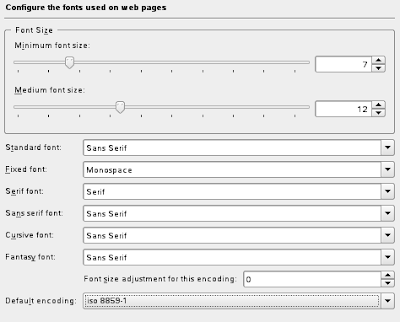

## July
### You hate Ubuntu

[//p65]: # (https://web.archive.org/web/20171012232301/http://linuxhaters.blogspot.com/2008/07/you-hate-ubuntu.html)

*Posted Wednesday, July 2, 2008 @ 10:52 AM. 257 FLAMES*

The results are in. The most hated community Linux distribution is.... Ubuntu!
Yay! Hurray!

The final results were:

1. Ubuntu: 27%
1. Gentoo: 25%
1. Fedora: 12%
1. OpenSUSE: 10%
1. Debian: 9%
1. PCLinuxOS: 7%
1. Slackware: 7%

Fuck. There are so many distros that it's even hard to choose which one to
hate.

Actually, the result isn't quite so surprising, considering that there are
probably far more Ubuntu users out there than for the other choices. So just in
case someone feels like pointing out the obvious: here are the results if you
normalize them their distrowatch scores (calculated by taking # of votes /
distro watch score * 100)

* Debian: 9.6
* Ubuntu: 11.5
* Fedora: 8.5
* OpenSUSE: 6.1
* PCLinuxOS: 6.1
* Slackware: 13.9
* Gentoo: 54.0

As suspected, Gentoo, is the landslide winner here.

But it doesn't really matter. In the end, more votes equals more hatred. Even
if more gentoo users hate gentoo, the fact that there are fewer of them total
means gentoo has done less damage on the world at large. So Ubuntu it is!
Congrats guys. It's really impressive. You should come out of your basements to
tell your parents.

### KDE fork-dot-zero

[//p66]: # (https://web.archive.org/web/20171113091528/http://linuxhaters.blogspot.com/2008/07/kde-fork-dot-zero.html)

*Posted Thursday, July 3, 2008 @ 2:20 PM. 131 FLAMES*

As a shit-storm chaser, it's been fun watching the fecal hurricane that has
resulted from the KDE4 devs chucking their shit-pile 4.0 into the proverbial
fan that is the internets.

With this theme in mind, today, I'd like to call out the jack-assery of a
particular kind of luser: the luser journalist. Typically, these journalists
occupy positions of large influence (or they believe they have influence, at
least) and they pontificate their opinions that show they don't have any idea
how anything works.

Two in particular I'd like to say WTF! to: Mr. Ryan Paul of Ars Technica, and
Mr. Steven J. Vaughan-Nichols. Steven is a former Ziff-Davis Editor, who's been
[publicly ranting against KDE4][86], and recently [even called for a fork][87].
Ryan is a born-again KDE4 apologist. He recently posted [this article][88] to
counter Steven's ranting.

[86]: http://practical-tech.com/operating-system/kde-404-bad-just-plain-bad/
[87]: http://practical-tech.com/operating-system/kde-its-time-for-a-fork/
[88]: http://arstechnica.com/news.ars/post/20080702-the-critics-are-wrong-kde-4-doesnt-need-a-fork.html

You know, it's really nice that you guys are having a nice open public shit
eating contest like this, but it really pisses me off at the same time, because
**_you are both wrong_**.

Steven says:

> But, I doubt it. I pick up new desktops and interfaces all the time.
> Switching from one system to another is second-nature to me. KDE 4.1 has
> taken KDE down a path I don’t want to follow. So, I have a suggestion. Fork
> KDE.
> 
> This is open source. All forking a project really requires is that developers
> and end-users decide that another path is a better path. So it is that I’m
> suggesting that if some developers decided that they could build a better KDE
> by revisiting KDE 3.5’s vision of the desktop, they’d find many users more
> than willing to give it a try.

Oh really? is that all that a fork requires? Cuz you know, I thought it meant
that users and developers not only have to agree on what they want (which is
*much* harder than agreeing on what they *don't want*), and then they have to
write the code, test the code, and maintain the code. Multiply that by the size
of the code and distribute it over the fewer number of heads you'll have
joining your cause.

And, besides, what are you going to call it, FunKDE4?

Then Ryan responds by saying KDE4 is not so bad. And how he was skeptical at
first, but how he believes, blah blah, and ends with:

> I encourage users to look beneath the surface and try to understand how the
> emerging features fit into the long-term roadmap. There is a lot to like in
> KDE 4.1 if you are willing to approach it with an open mind and not simply
> dismiss it because it's different.

Ah ok. I'll go ahead and encourage my grandma to understand that there's this
QT4 thing, you see? and that there's these things called plasmoids which aren't
bursts of hot intenstinal gas, but rather an abstract concept that you have to
understand just to get part of your familiar desktop back. And I'll tell her to
just wait a few months or years so that she can get all the things she used to
use. I'm sure she'll be really happy with that. Seriously, her time on this
earth is limited, but she'll spend the rest of it learning about her new
desktop that has little boxes that [look like cum stains][89].

[89]: http://arstechnica.com/news.media/kde41b2folder.png

Seriously guys, what the fuck. As serious journalists, shouldn't you guys keep
in mind what actual users might want?

This is a classic example of open source devs making a mistake. Most existing
users of KDE3 (or any desktop for that matter) want *incremental* improvements.
They use KDE3 because they already like it. They don't want a "sexy" new
desktop. Changing everything from out and underneath them will not make them
happy.

If KDE4 is so radically different, then they should have called it something
else. Having the 4 implies that users of 3 will eventually be forced to
upgrade, not because they want to, but because 3 will bitrot and devs will only
care about 4. That's what the users are reacting to. They don't understand why
they should have to learn something new that isn't significantly better than it
was before.

Why didn't the KDE devs decide to just start writing parts of KDE in Qt4? Who
knows. Cuz it wasn't sexy? Probably. Unfortuantely, most computer users don't
care if the devs are sexy, or whether they're working on sexy features. They
want to keep what they have, and get more stuff that helps them do more.

Is KDE4 significantly better? Who knows. It might be. It might not be. Was it
worth jeapordizing the reputation of a popular project to find out? Probably
not. Was it worth making it seem like it was an entire re-write when the same
functionality could have probably been brought in incrementally? Definitely
not. But you know, the devs aren't ever held responsible for what they do. So
don't expect any sanity.

Personally, I don't give a shit. KDE can go dig it's own grave for what I care.
It's just a bunch of devs that want to constantly re-invent things because they
think they can do it better. Or people who think that because the toolkit
rev'ed, they have to re-write the whole stack. At the same time they ignore the
fuck-ton of other problems that the Linux desktop still has. The problems that
actually prevent non-KDE users from switching to their platform. Earth to KDE
devs: we don't need plasmoids! we want boring, old wireless networking to work.

As for what Steven and Ryan were saying: No. Forking is not the answer. You may
be able to separate the sane devs from the lunatic ones, but I'm pretty sure
what you'll have left won't be enough to support a codebase as large as KDE.
And Ryan's "having an open mind, accepting something different, and being
patient" is not the answer either. The rest of the world doesn't have the time
for that, especially when there is no clear benefit to adopting the new and
different. KDE4 is mostly the same old same old, except my task bar is black
and I can group icons. Fun.

So what's the answer? I say fuck 'em all. Go invest your time in something else
where the devs aren't so full of themselves. Something where they have some
incentive to care about actual users. Cuz if you ask me, both their [words][90]
and their actions tell me that they don't give a shit. Even about lusers.

[90]: http://www.kdedevelopers.org/node/3535

### K-Pride

[//p67]: # (https://web.archive.org/web/20171113091234/http://linuxhaters.blogspot.com/2008/07/k-pride.html)

*Posted Monday, July 7, 2008 @ 10:52 AM. 98 FLAMES*

Hope you lusers had a good weekend. I mean, I was like, out doing stuff. It's
totally awesome that you guys decided to spend your weekend flaming each other
about my last post. And props to Eugenia for the link. I love all the comments
about the language I use here. If you can't deal with the language, get off the
fucking internet. Prissies.

Anyways, in honor of all the KDE panties that I've soiled, I'm declaring this
week to be **K Pride Week** (KPW for short), where I'll focus on fun KDE stuff.

To kick KPW off, let me generally respond to some of the things the KDE people
like to say. Why don't we call it something like "KDE talking points".

*If you don't like it and don't contribute, don't use it, and STFU*

Hey guess what. Your KDE desktop there? You're running some of my code. That's
right, I used KDE for a while, and even wrote some code for you asshats. Too
bad I was too blind to see at the time that KDE people don't care about their
normal users. But if you want to continue to claim that I'm just an outsider
talking shit, then try again, my friends.

And besides, freedom of speech, right? (Help! Help! I'm being repressed!)
Actually, you know what? It's not even that. It's the fact that I feel like I
wasted so much time on your poorly managed project that the world won't be
right until I get some value out of it. I played your game. It sucked. I'm free
to tell everyone else how much it sucked. Maybe I'll save them some time. Maybe
I'll do the world some good.

You claim that I'm providing no value. Well I have just under 2000 or so
readers that seem to disagree. So suck it.

*N.0 is an (alpha/beta/initial) release. What you want will come in N.1 or N.2
or N.3*

Hey guess what? You said this for N = 2, N = 3, and now N = 4. And each time,
you caught a lot of shit for it. Does that tell you something? Maybe that
people don't like it when you do that?

Fuck, I have a lot of problems with GNOME too, but at least they so far have
shown the sense to only pull some shit like that once.

*You don't have to spend any money on it, so don't complain*

Actually, it's not just KDE people who say that. But whoever it is, they always
forget the second part of that statement: "... but you have to spend a lot of
time on it." I spent tons of time. I fuckin' took your bait, and now I'm
pissed. Are you going to give me my time back? If you knew of a shady business
that was over-marketing what it was all about and misleading its potential
consumers, wouldn't you speak out too?

*It's for developers, you dipshit*

Oh really? Hmm, I'll quote from the [What is KDE][91] page (more on their
website in future KPW posts).

[91]: http://www.kde.org/whatiskde/

> ... KDE seeks to fulfill the need for an easy to use desktop for UNIX
> workstations, **_similar to desktop environments found on Macintosh and
> Microsoft Windows operating systems_**. ...

> ... It is our hope and continued ambition, that KDE will bring open,
> reliable, stable and monopoly free computing enjoyed by scientists and
> computing professionals world-wide **_to the everyday user_**. 

Maybe you guys should rewrite your page so that it says, "If you can't code
quicksort in at least 3 programming languages, please go away."

### Turn your head and KOffice

[//p68]: # (https://web.archive.org/web/20171113090935/http://linuxhaters.blogspot.com/2008/07/turn-your-head-and-koffice.html)

*Posted Tuesday, July 8, 2008 @ 6:42 PM. 91 FLAMES*

You know, just when I thought it couldn't get any worse with OpenOffice, along
come the KDE folks with yet another office suite.

Why? Seriously? Why? goddamnit. Every line of code you guys write for KOffice
is a line of code that could have gone into improving OpenOffice. Please know
that you are probably doing the world more harm than good by working on this.

Maybe someone thinks that if Linux has like 3 billion office suites, then it
can finally take over MS Office? I mean, there's so much choice. Who could
possibly resist?

KWord. It like, totally integrates with your desktop. Like it uses the same
icons. And colors. Cool. It can also show me garbled versions of documents that
people send me. With fonts and colors that are consistent with my desktop.
Sweet. Oh, and it's based on [frames][92], apparently. Frames! Did I mention
that it's based on frames? Frames are awesome. Frames. Frames. Frames. The fact
that it's based on frames apparently makes up for all its deficiencies, I
think. Wow, in all this time I've used MS Office, I didn't realize that I
needed frames so much.

[92]: http://www.koffice.org/kword/

KSpread. Pretty much the same as KWord, sans the frames.

BTW. I hear these apps don't really support macros, cuz, like they're insecure
or something. Never mind that they're hugely useful. Oh, but they have DCOP!
hurray for DCOP!

K\*. Yea I'm tired of this game. I get it. You pretty much made 1:1 clones of
MS Office components. Except for Karbon14 and Krita, which are drop-in
replacements for Illustrator and Photoshop. Uh huh. Just like the Open Office
guys. Sweet. Doing the same work but in a slightly different way is totally
like cooperating right? Go open source!

Oh I know. Maybe if you made all your apps frames-based, people would care.

Also BTW, just in case this somehow made you want to try it out, [don't try to
type the euro character][93]. Seriously, just copy and paste it from here: € .
See, now that wasn't so hard was it?

[93]: http://www.koffice.org/kword/euro.php

### What is KDE?

[//p69]: # (https://web.archive.org/web/20171113091325/http://linuxhaters.blogspot.com/2008/07/what-is-kde.html)

*Posted Wednesday, July 9, 2008 @ 8:11 PM. 119 FLAMES*

*Administrative note: Google banned my ads! WTF? Anywhow, they've totally
earned a spot on my lame lusers list. So instead, you can check out some [LHB
merch][94]. Not much there yet. We can do a T-shirt design contest or something
lame like that.*

[94]: http://www.cafepress.com/linuxhatersblog

So, once in a while, some random person (lets say my poor old grandma) will ask
me, "What is KDE?". I'm too lazy to try to come up with an explanation myself,
so instead I refer to the [What is KDE page][95]. Surely, it's linked right off
the front page, so it should be perfect to explain to lay people what KDE is
all about, right?

[95]: http://www.kde.org/whatiskde/

I'll just start at the top.

> KDE or the K Desktop Environment, is a network transparent contemporary
> desktop environment for UNIX workstations.

Woah. I think you lost my grandma already. She probably thinks its some kind of
kinky see-through environment for eunuchs.

> KDE seeks to fulfill the need for an easy to use desktop for UNIX
> workstations, similar to desktop environments found on Macintosh and
> Microsoft Windows operating systems.

Oh, so you are just a crappy copy. Ok, cuz I was gonna say...

> The UNIX operating system is according to us the best available today. When
> it comes to stability, scalability and openness UNIX has no competition.

Wow. According to the rest of the world, you have no idea what you're talking
about.

> In fact UNIX has been the undisputed choice of information technology
> professionals for many years.

Really? cuz I see a lot of Windows around... but that must be just me. Carry on.

> The lack of an easy to use contemporary desktop environment, however, has
> prevented UNIX from finding its way onto desktops of typical computer users
> in offices and homes.

Oh. No way! That's why?! I totally thought I hate it because there were no apps
and none of my hardware worked. Wow, thanks for clearing that up!

> UNIX today dominates the server market and is the preferred computing
> platform for computing professionals and scientists alike.

I think you meant to say that lusers like it. It's ok. I'll let that slide.

> The Internet, a household name traces its heritage to UNIX.

Cuz you know, the internet wouldn't have existed if it weren't for UNIX. I
mean, Windows or Mac can't do networking at all. It had nothing to do with
DARPA or anything.

> In spite of such ubiquitous creations from the UNIX community, average
> computer users still expect it to be difficult to use and often stay away.

Wait wait. Let me guess. Is that because it is difficult to use?

> This fact is particularly unfortunate since a number of implementations of
> UNIX, all of which are of exceptional quality and stability (Debian
> GNU/Linux, FreeBSD, NetBSD etc.) are freely available of the Internet.

It's also particularly unfortunate that there are several exceptionally high
quality implementations of HOT WOMEN like Jessica Alba and Angeline Jolie but I
keep getting permission denied errors when I try to access any of them. Perhaps
they too are lacking a usable desktop environment.

Anyways, guys, I think you lost my grandma like 20 minutes ago. She's like,
over there knitting or something. You had your chance.

I really am amazed at how you guys can sound so serious and at the same time
show that you are so misinformed. That still has to be good for something? When
I start my faschist anti-Linux movement, I'll be sure to recruit you guys to
run my propaganda machine.

### I can chooz KDE too?

[//p70]: # (https://web.archive.org/web/20171113090755/http://linuxhaters.blogspot.com/2008/07/i-can-chooz-kde-too.html)

*Posted Thursday, July 10, 2008 @ 5:41 PM. 163 FLAMES*

Alright. OK. I hadn't used KDE in a while. Surely, some things must have gotten
better. So I installed OpenSUSE 11 just to check it out. Cuz like, SUSE was/is
the best KDE distro right?

I start up the browser, and type in www.slashdot.org...

{width=256px}\

Wow, and this is supposed to be easy to use? How many users know what cookies
or domains are? But it's nice to know that this window is from the KDE Daemon.
Great start, guys.

Whatever, let me pull up gmail...

{width=400px}\

OHHHH! DISSSS! Didn't Apple make safari out of khtml or something? Didn't gmail
work on Safari years ago? What's the excuse this time?

Whatever, let me go change some settings...

{width=400px}\

Hmm, how do I set fonts for other languages? Maybe I can haz English only?

Which encoding is "this encoding"? And is everyone supposed to know what
encodings are? And are they supposed to know what all these cryptic names like
iso8859-1 are?

{width=400px}\

Wow. Choice is great. Except none of these are what I want. What does "Use with
care" mean? Why is there no "Use memory efficiently (and just work)" option?

Ok whatever, let met check out these text editors that people keep talking
about.

{width=400px}\

Ok, so for whatever its worth, Kate and Kwrite seem exactly the same to me,
except one has like 3 more buttons. Oh, but maybe the [Kate page][96] will help
explain this.

[96]: http://www.kate-editor.org/

> The Kate project develops two main products: KatePart, the advanced editor
> component which is used in numerous KDE applications requiring a text editing
> component, and Kate, a MDI text editor application. In addition, we provide
> KWrite, a simple SDI editor shell which allows the user to select his/her
> favourite editor component.

Wow, so you made a whole 'nother app just to make it have an SDI interface with
the same features. And then you made it so that the only configurable text
editor interface you can use is the same one as Kate. Wow, that's a totally
awesome use of time if you ask me.

On to more of the desktop. I heard the KDE window manager was pretty
configurable. Let me check out the settings I can apply to specific windows...

{width=400px}\

Ok, someone please explain to me what all those different options mean? How is
Force and Force Temporarily different? Can I Remember and Force at the same
time? How is this usable at all? Do I have to read the source code to figure it
out?

{width=400px}\

One last blow. I fired up KDE4 since it was supposed to be good as long as I
didn't need anything. Well, it turns out that I can't even change the desktop
size on the fly. Surely, nobody needs to do that. (BTW, make sure to check out
my rotated Firefox desktop icon. Cuz that's totally useful)

### Wild rationalizations

[//p71]: # (https://web.archive.org/web/20171113085428/http://linuxhaters.blogspot.com/2008/07/wild-rationalizations.html)

*Posted Friday, July 11, 2008 @ 9:29 PM. 255 FLAMES*

I was getting a little worried that I wouldn't have something appropriate to
close of K-pride week with, but then [sweet feces rained down from heaven][97].
It's an article from Sebastian Kügler from the KDE board of directors,
explaining the "11 myths of KDE 4".

[97]: http://www.groklaw.net/article.php?story=20080710131440951

Here we go...

> Actually, KDE 4.0 is just the beginning. KDE 4.0 has the beginnings of a
> publicly usable desktop and applications. KDE 4.0 also marks the stability of
> the libraries and their programming interfaces so application developers can
> actively start using them in their application. The new features and
> frameworks need some time to be implemented in a user-visible way. In that
> light, KDE 4.0 marks the beginning of the availability of
> KDE4-technology-based applications.
> 
> Assuming that KDE 4.0 delivers the full possibilities of its libraries and
> frameworks to the user is unrealistic. The merit of the infrastructural work
> that has led up to 4.0 will be seen in the coming releases, with KDE 4.1
> showing first signs of an increased pace of development thanks to the new
> foundations.
> 
> KDE 4.0 is the starting line, not the finishing line.

So it turns out, that in almost every other major software release every made,
a .0 release is used to convey some semblance of completeness. Like it or not,
it's convention. It's a language of sorts, used by software producers to
communicate to their users. Yes, I know. .0 releases usually suck for any
software. But in the majority of the cases, it's due to *unintentional bugs*.
In other words, it's not by design. But you know, KDE decided it was so awesome
that it could totally ignore this convention. .0 isn't anything. It's just the
start, they said. We know it sucks. We told you so.

If that's not arrogance, I don't know what is. And they thought a few posts on
blogs nobody reads would clarify it for the rest of the world. Yea. Uh huh.
Please hold while I aim my clue cannons in your general direction.

> This has been consistent in all communications. We only failed with KDE 4.0
> if we measure the work based on others' criteria, not our clearly stated
> goals. We're glad that so many people eagerly anticipated the 4.0 release,
> but in some cases the expectations were heightened despite our efforts. We do
> understand the excitement that built up over 2 years, but we've actually had
> discussions on trying to meter/throttle people's exuberance and expectations
> for 4.0 so that they would not feel let down when 4.0 was released.

Well, apparently you didn't discuss enough. Because I think you kinda failed.

> Let's look at it from a broader perspective for a while. Let's see it in the
> Grand Scheme of Things to Come. The big question that should come up is:
> couldn't we have released what will now be KDE 4.1 as KDE 4.0? If that would
> have been possible, it would surely have been the right choice. But it was
> not possible, because of several reasons.
> 
> Release early, release often. One of the pillars of Free Software development
> is to release your software as soon as it is useful to others, so people can
> jump in.
> 
> Nobody has ever promised that KDE 4.0 would be functionally equivalent to KDE
> 3.5. With KDE 4.0 we have delivered a stable set of libraries and a basic
> functional desktop. 4.0 in technical terms means: From this point on, our
> libraries will remain binary compatible until 5.0. Not releasing 4.0 at that
> point means holding back hundreds of application developers from porting and
> releasing their applications. Not releasing would hurt these applications -
> they wouldn't receive the attention to detail they deserved. We're talking
> about core applications like Dolphin, but also whole parts of KDE like the
> Educational applications, Graphics applications, and the games. Not releasing
> them would also mean less new contributors and users than they deserved -
> another thing we didn't want.

You guys are so amazingly wrong that, well, it's amazing.

Release early, release often is a well-known strategy, sure. But nowhere does
it say release things in forms that will confuse users into thinking it is a
complete release.

Yes you didn't say that 4.0 would have all of 3.5. But look at all the other
software that's been released, like, *ever*. In most cases, (N+1).0 has all (or
at least most) of the features of N.0 and a bit more. And those new features
mostly work, as well as the old features. This is what users expect when you
call it 4.0.

But actually, as far as I can tell, you guys called it 4.0 because you knew it
had this effect. It's not release early, release often so that all the devs can
better coordinate. Instead, it was call it 4.0 so that we can trick a bunch of
users to test our fancy new library code even though it breaks all the features
that they're used to. And if they fall for it, we'll just say that we warned
them subtly.

As you have found, users don't care about a release that only lays the
foundation for binary compatibility and has no features that they actually want
to use. And guess what? That's also why people don't go for Vista. Do you have
to copy everything that Microsoft does?

The argument that without a 4.0 release, downstream developers couldn't get to
work is pure bullshit. Companies do this all the time. They release pre-release
builds so that people can write new pieces on top. What is it about a 4.0
release that is suddenly going to make a bunch of developers start working on
KDE4 versions of their apps? Nothing. It's still just as inconvenient. If they
want to write a KDE4 version, they have to do a SVN checkout anyways.

And by the way, it's truly shocking that you guys have the audacity to bring up
binary compatibility as any kind of justification. All open source projects
seem to think binary compatibility means that old binary apps link and load.
They always forget the crucial third part: *the old apps also have to work*.
Making sure old binary apps work is a lot harder than making them link and
load. You actually have to test things. But I know that's beyond y'all so I
won't tire my fingers explaining it too much.

> Yet the publicly perceived quality of KDE seems to concentrate on Plasma, the
> newest, but most visible component of KDE 4. For this kind of new technology,
> it simply takes a bit of time and feedback from users until the user
> experience we could deliver in the past can be reached.

Uh huh. 'round here I believe they call that a beta.

> A second issue is packaging. KDE 4.0 is relatively hard to package, not due
> to it being that difficult - packaging it is far easier and faster than KDE
> 3.x. But it is new, and new things always require an adjusting period. CMake,
> SVN, many new dependencies, many new architectural pieces, changes in the
> internal structure of the major KDE packages like KDElibs and KDEbase...it'll
> take a while for packagers to get used to those. We probably can't expect
> distros to put out KDE 3.5.x-quality packages for at least a few months. By
> the time 4.1 is released, though, they will have some experience, and will
> hopefully get it done rather quickly. (If you want the proof - just check out
> a few different KDE 4.0 distributions...they differ wildly in terms of
> stability, features, default setup, and more.)

Oh it's the distro's fault is it? If you actually cared, you'd work to make
packaing and distribution easier. But instead, you change stuff all over the
place, and then blame the distros for not getting it right. Impressive is your
foresight.

> A third reason is for finding rare, obscure, or corner-case issues. Many of
> the problems in KDE 4.0 can and will be fixed by the KDE hackers. But many
> can't. By pushing the boundaries of technology, you'll be pushed back. We've
> exposed issues in drivers, architectural issues in X, window management, Qt,
> and more. Without an earlier release to start getting user feedback, these
> simply would've appeared in the delayed first release, and would've bit users
> just as hard as they're biting now.

Again. 'round here they call that a beta. Or maybe an alpha. Maybe you should have called it "KDE-4 Completely Untested Edition"

> And finally, KDE is a very complex beast, technically and socially. It
> consists of hundreds of applications, an extensive development framework and
> a desktop on top of that and literally hundreds of contributors with diverse
> backgrounds. It is plain impossible that all those things happen to be
> finished at the same time. We were able to release a basic first version of
> the desktop along with the development framework and an already very good
> looking set of applications. We did fail in communicating well enough this
> complex situation. But then, we're software developers, we create software
> ...

And creating good software is not just about writing good code. It's about delivering it. Marketing it. Testing it. You guys are such a prominent open source project, and yet you continually show that world that you have no idea how to do anything except be architecture astronuts.

> While the underlying technology provides lots of new means to interact with
> computers and will have even more ways of working with different sets of
> users on different devices, the desktop interface in KDE 4.0 and KDE 4.1 is
> mostly backwards compatible with desktops as we've seen them in the last 20
> years, containing a panel to switch between applications, a menu launcher,
> and several bits of functionality such as the clock. Users are not forced to
> learn new paradigms unless they want to take advantage of new features such
> as the dashboard and applets.
> 
> The desktop interface has not been radically redesigned in the last twenty
> years. The KDE team is working on laying the groundwork for new and
> innovative ways of dealing with the desktop while providing the traditional
> ways of interacting with the desktop so current users are not alienated.

If the idea of desktop hasn't changed in 20 years, then why change your
implementation every three? Do you know why even Windows Vista implements a
'classic' mode? It's because users get used to the **_pixels_** not just the
"paradigms". They know what their close buttons and title bars look like. It
matches how they all look in their training manuals. Not constantly changing
things allows others to build on top of your work, to actually learn things,
and maybe even document them. I think you guys should really go out into the
real world and see how many people even understand what "minimize" and
"maximize" mean. After 20 years, many people still don't even get the
paradigms, and yet you're changing how everything looks, and relying on the
fact that the paradigm is the same. It sounds like a fool-proof plan if you ask
me.

> KDE, as a Free Software project, is more open to its users than any other
> comparable software team. All mailing lists are open to suggestions,
> development can be closely followed through SVN, and developers are usually
> easily reachable for interested parties, either through their mailing lists,
> on IRC, or directly via email.

What does "open to its users" mean exactly? Because from your actions, it seems
to mean that there's some web form that they can fill out to complain, but you
won't really listen because you never really cared in the first place.

> The developers do depend on precise information, however. Vague statements
> such as "I don't like the new foobar" are hard to address. Precise reports
> detailing current and expected behavior along with use cases (and sometimes a
> bit of patience) increase the odds of issues being addressed. Insulting,
> whining, or spreading FUD does no good to a developer's motivation to address
> issues; instead the usual effect is to cause the developer to become
> demotivated in regards to fixing a particular issue. Users that would like
> certain functionality in KDE 4 should be collaborative and helpful and open
> to new solutions.

Unbelievable. You guys totally botched the communication around your brand
spanking new release, and yet your telling your users to exercise caution when
communicating. That's rich. I wish I were that rich.

Also, I think you forgot a sentence: "Developers who wish to be helpful and
respected should listen to and understand the actual problems that the users
are facing."

> In some cases, we need to balance out when to listen to certain users or not.
> After all, we are probably leaving some people comfort zone. There is always
> resistance to change, yet change is necessary for survival. A certain amount
> of room for innovation is needed, and in fact lies at the heart of Free
> Software. KDE 3.5 wouldn't be the stable product it is now without ignoring
> some of the voices once in a while, and KDE 4 would never become reality.

I believe ol' GWB said it more succinctly. "You're either with us, or you're against us."

But really, the best part is at the end...

> "KDE should just have ported KDE 3.5 to Qt 4 and not add all that other
> experimental stuff right away"
> 
> This is not a stupid idea and it was heavily considered. The problem with it
> is two-fold: social and technical.
> 
> Socially speaking, it assumes redirecting development effort is effective. To
> a certain extent it is, **_but for quite a few developers not developing
> features often means not developing at all_**. Not everybody is good at
> low-level stuff (or willing to do it). This has bitten us and other projects
> in the past and present. The development of KDE 4 has been slower than it
> would've been if we would be able/willing to force developers to work on
> whatever some top-down managers think is good...but it's just not how FOSS
> works.

Have you guys heard of the old 20/80 rule? You spend 20% of your time
implementing your features. Then 80% of the time testing them and debugging
them. What you've pretty much told me in this paragraph is that you guys only
do the 20 part, and nobody wants to do the 80 part, and that's how FOSS works.
Thanks, really. You've explained a lot.

But just in case there's some sense in this whole article, let me hear out your
technical arguments...

> Technically speaking, two arguments. First, an only-ported release would in
> time have to be reworked again, so we couldn't promise binary compatibility,
> and the first release would be useless for development of third-party
> applications. It would really be nice for users, but a total waste of time
> from the point of view of developers - the progress of KDE as a development
> environment would be minimal at best. And that development environment
> happens to be the major focus of KDE 4.0 - we want to push the Free Desktop
> further (long-term vision).

As I've stated already, the kind of binary compatibility that you guys provide
is not even useful. So why would anyone care? And besides, which binary-only
app that uses KDE libraries is everyone clamoring for? I can't think of a
single one.

You also claim that this work would be a total waste of time for developers.
Well, go ahead, rewrite the code. You'll have wasted a bunch of users time who
bothered to learn your crappy desktop in the first place, and then you'll end
up wasting your developers time too because all your remaining users will have
left in disgust. Oh wait. I get it. Are you guys secretly trying to see how
much total time you can waste? Haha. That's HILARIOUS.

> A second problem would be the fact the developers would have to port a huge
> amount of old code which wouldn't be needed on the new platform. Prime
> example here are KDesktop and Kicker. Many users asked the KDE developers to
> port Kicker and KDesktop to Qt 4, but they didn't because it would be a huge
> job and in the long run unmaintainable anyway. In other words, it would delay
> the release of Plasma by at least another year, with no long-term benefit at
> all. The same goes for audio and video capabilities, all chat and PIM related
> capabilities, etc. In other words, a LOT.

No long-term benefit? How about the benefit that your users will love you
because they will get incremental new features. And then maybe they'll actually
believe that FOSS works and help you get more users and contributors. But no,
back to the sad reasoning that is all too typical of KDE. "Ohhh its too hard!
Let's start over! Fuck the users!"

There's some brain cells in the back of my head that secretly hope that your
users will continue to protest against you and drive your whole damn project
into irrelevance. Unfortunately, those brain cells are getting louder and
louder.

### Rants heard 'round the Community ver. 9

[//p72]: # (https://web.archive.org/web/20171113091052/http://linuxhaters.blogspot.com/2008/07/rants-heard-round-community-ver-9.html)

*Posted Saturday, July 12, 2008 @ 8:35 PM. 50 FLAMES*

Nice quiet weekend here. I'm kinda sad that K Pride Week is pretty much over,
but that doesn't mean we have to stop making fun of them. I'm sure they'll keep
providing us with good laughs as time goes on. Seriously, sometimes writing this
blog seems too easy.

Got a few links for y'all today (Thanks to all those who sent them along). In no
particular order:

1. Long time Gnome contributor Jeffrey Stedfast laments the state of Pulse
  Audio, and [decides to do something about it][98]. He comes up with a few
  patches to make Gnome apps not totally suck when pulse audio has a hissy fit.
  I believe this technique is called "defensive programming" a.k.a. "dealing
  with FOSS bullshit." As usual, comments are required reading.

[98]: http://jeffreystedfast.blogspot.com/2008/07/more-pulseaudio-problems.html

1. Nate Lawson points out a [gaping hole][99] when it comes to review process
  for core security infrastructure in debian. Again, read the comments.

[99]: http://rdist.root.org/2008/05/19/debian-needs-some-serious-commit-review/

1. [PromotingLinux.com][100] is kind of a weird site that I can't decide if its
  just humor or some crazy dude. I hope it's both, since that's always the
  best. I see they've trademarked The Truth. Good for them.

[100]: http://www.promotinglinux.com/truth/

1. And finally, if you've been reading Planet Gnome lately, you'll know about
  how all the devs are wasting their time by creating mockups of their apps
  with gratuitous tabbed UI's. Ha ha. I get it. I hope Apple and MS engineers
  came up with at least a 100 new killer features while you guys were working
  on those mockups. And also, it looks like [one of your guys didn't get the
  memo][101]. I can't really decide what this means. But one thing seems clear,
  there are at least some people out there who either believe that OSS devs
  would do this (which doesn't speak much for the reputation of OSS devs) or
  believe that this is actually a good idea (which doesn't speak much for their
  own reputation).

[101]: http://blogs.gnome.org/cneumair/2008/07/12/if-i-were-at-guadec/

### Feel the source

[//p73]: # (https://web.archive.org/web/20171113090751/http://linuxhaters.blogspot.com/2008/07/feel-source.html)

*Posted Sunday, July 13, 2008 @ 1:57 PM. 174 FLAMES*

A good majority of the FOSS crowd seems to argue that distributing source code
is always a great thing. Well I'm here to say that it's not all peaches and
cream. The OSS convention of primarily distributing source code packages has
many downsides that nobody seems to want to talk about.

First and foremost, the OSS model forces downstream projects to make decisions
that should be made by upstream developers. What are those decisions? for
example, which compiler should be used? what compiler flags should be used?
what versions of libraries should something be built against? When compiling
software for distribution, there are many such secondary decisions that need to
be made. It makes a whole lot of sense for these decisions to be made by those
who wrote the code, i.e. the upstream developers. But in the innovative Linux
world, most of the decisions are made downstream, at the distro level, by
people who don't really understand the code but know how to make an rpm. Even
if they are somewhat familiar with the code, surely, the original authors of
the code know more. Yet these package maintainers are the ones making these
crucial decisions that can affect the performance and stability of the final
product. This isn't freedom of choice. This is giving other people the freedom
to fuck things up.

Number two. Source distribution dilutes upstream testing efforts. Any software
tester knows that as far as testing and QA is concerned, *different binaries are
effectively different test cases*. Each time a downstream project patches a
program's code, or compiles it in a different way, they're essentially creating
a fork of the code. This instantly undermines all of the testing that was done
by the upstream project. Even fossclowns can see that this can cause problems.
In the most obvious cases, you end up with something like the Debian OpenSSL
debacle. In the more subtle cases, you get end users reporting problems because
the distribution used a compilation flag that the upstream developers didn't
test, or because they used a different library version than what was on the
developer's box when he did a svn commit. They said FOSS would be better
because it gets globally distributed testing of shared code. In actuality,
everyone is testing slightly different binary translations of the shared code,
so any benefit is effectively spread across these many variations.

A simultaneous effect: source code distribution also causes duplication of
effort downstream. We've already seen that every distro has to do everything
themselves in their own way, and that surely includes to solving all the same
problems that every other distro faces. Which compiler should they use? which
library versions should they use? Which versions of the pieces work well
together? Not only are the hundreds of distros not sharing their testing and
integration efforts, *they are actually duplicating those efforts many times
over*. So much work that can't be re-used by other distros, because everyone's
configurations are different. It's a huge waste. Guess why even as the number
Linux users and testers increase, the quality of distros doesn't really
increase proportionally? Every new distro just adds to the waste and does all
the same work as everyone else. But hey, all the work is free right?

Things aren't all rosy from the developer's point of view as well. But how can
that be? I mean, developers love source code, right? Well I'm glad you asked.

One common thing you'll see with OSS libraries is that they don't come with
very good documentation. It's OK though, the dev's say, since you can just read
the source code. To someone who doesn't write code, that may sound just fine.
Who needs docs when the code says exactly what it does right?

Wrong, unfortunately.

Let's put aside the problem that reading source code to figure out what
something does already totally sucks. No, I'm saying that as far as
documentation for API's go, the source code is often too specific. When a
developer can see the implementation of a particular interface, he can also
very easily and inadvertently start to depend on the particular characteristics
of the implementation (often characteristics that the implementor didn't even
intend in the first place). Source code "over-specifies" an API. The worst is
when developers start depending on the bugs.\*

Of course, the proper way to do this is to document your libraries and
interfaces and hide the implementations. Make your assumptions clear, yada,
yada. There are tons of software engineers that understand this. The problem in
OSS is that *having the source code serves as an excuse* not to create this
documentation. "Just look at the code" they say, as if its the same thing.
That's where both library consumers and implementors get into trouble.

Another more mundane problem. How do developers recoup their development costs
while giving all their "secret sauce" away? This issue has been debated to
death in other forums, but it's still worth mentioning here. Yes, I'm tired of
y'all telling me that Google made cash-money off of open source. But you know
what? they're not selling software. If your goal is to produce pure software
products for end users to consume, what's the business model? I'm sure
someone's gonna bring up Redhat, but do you want me to go over the Redhat vs MS
vs adobe revenue numbers again? In the end, while there have been some
entrepreneurial successes around open source, there have been very few, if any,
where a company wants to sell software itself. (And getting bought by Sun
doesn't count)

Last point. The fact that open source projects mainly distribute source code
actually prolongs all the problems above. If all OSS projects were to actually
try to distribute binaries, they'd realize how fucked up the situation actually
is (and maybe they'd even try to fix it). And if OSS devs can show that they
can coordinate enough to actually distribute their own stuff in binary form,
then surely commercial companies will soon learn to play along and join the
fray, benefiting everyone. But I'm definitely not holding my breath.

Note that I'm not saying that source distribution doesn't have it's place. It's
useful for fixing bugs, and coordinating improvements to upstream code. But too
many fosstards dismiss binary distribution without acknowledging its inherent
benefits. That's just ignorant.

\* Note that, not having source code doesn't entirely prevent this. There are
many famous examples in Win32-land where programs depend on bugs within the
runtime, I claim that similar mistakes are strictly and significantly easier
when source code is available.

### Why Linux is NOT Better.com

[//p74]: # (https://web.archive.org/web/20171113085517/http://linuxhaters.blogspot.com/2008/07/why-linux-is-not-bettercom.html)

*Posted Monday, July 14, 2008 @ 11:53 PM. 283 FLAMES*

Nice! I just found this site off of reddit: [Why Linux is Better.com][102].
Fortunately for me, it reads like a talking point manual for your local
neighborhood Linux zealot. I thought we might have a bit of fun with this one.

[102]: http://www.whylinuxisbetter.net/

**Forget about viruses.** I think [we went over that already][103].

[103]: http://linuxhaters.blogspot.com/2008/06/at-least-we-dont-have-any-viruses.html

**Is your system unstable?** Who knew. When a system doesn't do anything, it
doesn't crash. Oops, there goes NFS. Locked desktop. Oops I changed my IP
address. Locked desktop.

**Linux protects your computer.** What does that even mean? It sounds the same
as the first one.

**Don't pay $300 for your operating system**... but spend 10 weekends setting
it up.

**Freedom!** Yes, free yourselves form the shackles of sanity.

**When the system has installed, why would you still need to install stuff?**
Because the person that creates my OS can't possibly package everything? Duh?

**Update all your software with a single click...** as long as you only want
the selection and the versions that your distro provides. Don't you dare visit
upstream websites.

**Why copy software illegally if you can get it for free?** Why spend hours
making free software barely work when you can pay $50 and get on with your
life?

**Need new software? Don't bother search the web, Linux gets it for you**...
only if your distro has packaged it. Need software that's actually useful?
Don't bother searching the web. It's not there. If it's even remotely useful,
then your distro has probably already included it in a sad attempt to match the
functionality of other platforms. Need legal dvd playback? playback of DRM'ed
files? FAIL.

**Does your digital life seem fragmented?** No? Does anyone care? Is it so hard
to click three buttons to defragment?

**Choose what your desktop looks like**... to make yourself feel better about
it not being able to do anything. At least its pretty. At least your mom's
pretty.

**Why does your Windows get slower day after day?** Because you install a
shit-ton of crap on it? If the same large selection of software could run on
Linux, lusers would be having all the same problems.

**Do something for the environment.** Seriously? how about making serious power
saving work for desktops. Who cares about paper boxes. Tons of software on
other platforms are distributed electronically. It's not like distributing
linux ISO's saves any CD's either.

**Enjoy free and unlimited support.** By that you mean unlimited quantity, but
of rather limited quality.

**Use MSN, AIM, ICQ, Jabber, with a single program.** Yea, cuz you can't do
that on Windows or Mac.

**Too many windows? Use workspaces.** Yes. Spaces. Or Virtuawin.

**Don't wait years for bugs to be solved, report and track them down...** then
wait years for them to actually get fixed.

**Are you tired of restarting your computer all the time?** Why yes actually.
Ubuntu seems to want to restart when there's a kernel or X update, which seems
like every few days.

**Let your old computer have a second life**...by using a Windows 2000-era
operating system. Turns out Win2000 runs pretty damn well on that computer too.

**Play hundreds of games for free.** The world doesn't need more than freecell
and spider solitaire (and maybe pinball). Just imagine the decline in office
productivity if there were more games.

**Help other countries, and your own.** Yes, teach your citizens to program on
OS'es which nobody runs, so that when they can locally develop software,
there'll be nobody around to buy it. Surely, the rich countries with the cushy
jobs are all looking for XO and KOffice experts.

**Get a great music player.** Your example is amarok? Wasn't that whole gnome
3.0 tabs thing making fun of amarok? oh it wasn't? my bad... I was so certain
that it was.

**Keep an eye on the weather.** Because only Linux can display two digits with
an optional C or F in a blurry font, and an icon of a sun.

Sorry, that was too easy. This site spreading all these lies can have Google
ads but not mine? not cool.

### Don't feed the trolls!

[//p75]: # (https://web.archive.org/web/20171113085108/http://linuxhaters.blogspot.com/2008/07/dont-feed-trolls.html)

*Posted Tuesday, July 15, 2008 @ 5:19 PM. 112 FLAMES*

Looks like this [Manu guy took the bait][104].

[104]: http://www.manucornet.net/blog/?p=57

Let's just see what he has to say, shall we? (sorry, many blockquotes to follow)

> **Is your system unstable?** *“Who knew. When a system doesn’t do anything,
> it doesn’t crash.”* All of Google runs Linux. So Google doesn’t do anything?
> Well that’s news. Nasa probably doesn’t do anything either? The French
> administration doesn’t do anything? Oh wait, that was a bad example.

Holy crap. I've never heard this argument before! You know what, I'll help you
out. The NYSE runs Linux too! That's really great to know. I'll be sure to
recommend Linux to my grandma next time she wants to set up a global stock
exchange in her knitting room.

Lusers always like to find instances of companies or organizations with
extremely uncommon Linux use cases and somehow say that the reason that I
should run it on my computer. Hey, I know. My fridge runs an embedded OS called
FridgeOS (actually, I made that up, I don't know the name). It supports four
buttons and has better temperature controls than Linux. It's really stable.
I've never seen it crash. It's also really minimal and won't use all your RAM.
You should totally port it to run on your PC. That would be truly awesome.

> **Choose what your desktop looks like...** *“To make yourself feel better
> about it not being to do anything. At least it is pretty.”* Huh, were you
> just talking about Windows Vista? :-)

Wait. Is that a retort? Are you saying that Vista can't do anything? I think
there's a few people (or rather, a good part of the rest of the world) that
disagrees with you. Why don't you try talking to them once in a while?

> **Too many windows? Use workspaces.** *“Yes. Spaces.”* Oh, you mean that Mac
> OS X thing? So if I got two windows A and B on space 1, I put window B in
> front/focus, then I go to space 2, then back to 1, woops, now A is in front
> of B. And this is the newest version of the OS, released this year. Linux got
> this right 10 years ago.

Yes, spaces on OSX is kinda weird. But that's not my problem. I'd take the
usability, stability, and application availability of OSX over your slightly
better implementation of virtual desktops any day. Oh, and also, I think OSX
had something called working 3d acceleration on all their 3d capable hardware.
In the words of the late FSJ: Have you heard of it?

And BTW, you left out the part about Virtuawin. For that matter, you left out
like more than half of the points I made. You're just gonna pick on those parts
that you *think* you can win, and then show your ubuntu planet-reading fanboys
that you're full of victories, and then conclude that you win overall, right?
Nice. Class-ay!

Oh and BTWx2, please explain to me the difference between desktops, workspaces,
window manager viewports, and X viewports again?

> **Why does your Windows get slower day after day?** *“Because you install a
> shit-ton of crap on it? If the same large selection of software could run on
> Linux, users would be having all the same problems“*. Would they now?
> Fortunately for Linux, uninstalling software is done in a clean way and
> doesn’t leave a shit-ton of crap in your registry.

Umm, as one of my smarter commenters said, have you every tried 'make
uninstall'? Have you ever built anything from source because your distro didn't
happen to package the program you wanted or the version you wanted? Try
removing that. It's really fun. I swear.

> **Forget about viruses**. *“I think we went over that already”* (with a link
> to another post). Oh, so the problem of viruses in Windows is completely
> fixed, solve, basta, finito? That’s news as well.

Thanks for actually reading the post I linked. The post says your standard
luser argument is crap because the same characteristics that protect Linux from
viruses also "protect" it from useful third party software. Linux has thrown
the baby out with the bathwater and then proclaimed to the rest of the world
that it is really good at throwing out bathwater. If you actually had any clue
as to how hard it is to create a usable platform on which others can deploy
software AND at the sametime have reasonable security, you'd actually see that
modern Windows (XP SP2 and beyond) are pretty good attempts.

> **Linux protects your computer.** *“What does that even mean? It sounds like
> the same as \[the previous one\]“*. Does that mean the problems with spyware,
> adware, etc. is fixed as well? Well, great. Oh, but maybe you don’t know
> about them because you’re protected, right? How much did you pay for this
> protection? Are all users well protected? Is the average user well protected?
> I guess not because otherwise, all these crapware problems would have gone
> away by now, right? :-)

Uhh, I don't use any antivirus if that's what you're asking? These days it's
pretty easy to keep even novice users on windows from fucking themselves over.
Tell them to never install anything when internet explorer asks them to, and to
never open an attachment that outlook warns them about. That's about it. That's
a hell of a lot easier than teaching them to use Linux, and explaining to them
why they can't edit videos anymore.

> **Don’t pay $300 for your operating system.** *“But spend 10 weekends setting
> it up“*. Well, now I understand why you don’t like Linux that much, that’s
> because last time you tried to install it was 10 years ago! Got it. By the
> way, last time I installed Windows, it took me a whole day to go, fetch, and
> install all the device drivers for my hardware. And reboot after installing
> each one of them. Last time I installed Ubuntu, I spent 10mn in front of the
> screen, went away for 20mn, and everything was working and ready to be used
> when I came back.

Wow. I must send the Guinness World Records guys an email because I think
that's the longest version of "WORKS FOR ME!" that I've ever seen.

> **Does your digital life seem fragmented?** *“No? Does anyone care? Is it so
> hard to click three buttons to defragment?“*. Well if it takes 5 hours and I
> can’t use my computer during that time, yes. Oh but didn’t you just wonder
> whether anyone cared? So why are you still doing it? :-)

As someone also pointed out, Vista does this in the background. And RELAX!
nobody said you had to run defrag the same night that your term paper is due.
Just start it before you go to sleep. If you're super geeky, you can even set
things up so that it happens for you every weekend while you're out and about..
oh wait. Scratch that. I guess if you never leave your computer, then you don't
ever have any time to defrag. Sucks for you!

First I accuse your website of spreading standard luser lies. Then you come
back at me spreading more ridiculous arguments. I don't care if your website
has an obscure section about cases in which Linux might not be a good idea,
because that part is wrong too.

But the best part is, there are commenters on your blog post (and on others
I've seen), that all say "don't feed the trolls!" Is that really the best you
guys can do? Dude, fucking Miguel de Icaza himself links to this blog. He like
fucking invented Gnome or something. Have you heard of him? You think he's a
fucking idiot too? When faced with an insurmountable argument (aka the truth),
all you have to come back is "don't feed the trolls!". The more I hear it, the
more it starts sounding like "RUN AWAY! RETREAT!" to me.

### Lusers make me laugh ver. 1

[//p76]: # (https://web.archive.org/web/20171112223139/http://linuxhaters.blogspot.com/2008/07/lusers-make-me-laugh-ver-1.html)

*Posted Wednesday, July 16, 2008 @ 2:05 PM. 75 FLAMES*

Ok, here's a new column for you guys. Y'all have been getting better at sending
me links to posts and articles of freetards and lusers making asses of
themselves. So I'll collect them and list them, and we can all have a laugh.

* [9 File Managers for Linux][105]. Cuz like, 10 is waaay too many.

[105]: http://vivapinkfloyd.blogspot.com/2008/07/9-file-managers-for-linux.html

* [FSF's 5 reasons to avoid the iphone 3g][106]. Or rather, 5 reasons why you
  guys are still off your rockers.

[106]: http://www.fsf.org/blogs/community/5-reasons-to-avoid-iphone-3g/
* Sweet! Wireless status LED's on Thinkpad X61's work now. [You just have to
  recompile your kernel][107].

[107]: http://blogs.igalia.com/svillar/2008/07/16/back-from-guadec/

* [Soft core porn that was syndicated on Fedora Planet][108]. That's one classy
  programmer. And people wonder why there are few luserettes.

[108]: http://nicubunu.blogspot.com/2008/07/mixed-stuff-fonts-photos-games.html

* [Linux edges one step closer to world domination][109]. (about the OpenMoko).
  Choice quote:

[109]: http://www.linuxinsider.com/story/Linux-Edges-One-Step-Closer-to-Total-World-Domination-63798.html

> What makes Linux far superior to Microsoft's mobile software is that you can
> have different permutations of Linux smartphones. Historically -- and
> presently, for many of us -- smartphones are mostly pretty limited in scope.
> The software on them is abysmal; I can't even SSH into mine.

### The fallacy of choice

[//p77]: # (https://web.archive.org/web/20171110082006/http://linuxhaters.blogspot.com/2008/07/fallacy-of-choice.html)

*Posted Wednesday, July 16, 2008 @ 9:49 PM. 302 FLAMES*

I'm sure by now I don't really have to describe in detail this phenomenon: Whenever you criticize a luser about his choice of OS, he'll inevitably come back with, "at least it gives me choices." Choice in window manager, choice in terminal application, choice in file manager, choice in desktop environment, choice in kernel version, you name it.

This "choice", as loudly as it is trumpeted, is a key reason that Linux has not made it on the desktop. Let me attempt to show you why.

Every argument for "choice" is usually accompanied by a statement along the
lines of, "there are many different kinds of users that prefer different
choices, therefore we need to support all of them." In terms of distribution of
choices, given 10 choices, this statement implies the following type of
distribution.

{width=400px}\

In other words, ten equal choices with ten roughly equal-sized groups each
preferring a different choice. For some limited version of the world, this may
be true (for example, existing people who are FOSS users already, fighting
amongst themselves). But if you look at the general population at large, I
claim a different picture emerges:

{width=400px}\

Here, the blue represents the people who don't care about a particular choice,
and actively do **_not_** want to have to make a choice. They just want things
to work. They will take "working" over "choice" in an instant. They essentially
want the developers to make choices for them.\*

Linux and FOSS so far have optimized for the former picture of the world, not
the latter. In doing so, they've concentrated on inserting abstraction layers
and decoupled mechanisms at every layer of the stack: kernel, graphical
toolkit, command line shell, terminal program, text editor, office suite,
window manager, desktop environment, sound system, etc. etc.

In adding choice after choice, Linux moves *farther and farther* from what the
mainstream user wants.

Furthermore, any developer will tell you that each time a new layer of "choice"
is added, the possible number of configurations multiplies. This means more
untested configurations, more bugs, and more brokenness. Not necessarily due to
incompetence of developers, but rather simply due to the sheer number of
configurations that are possible.

So not only does the addition of so many choices alienate would be users, it
also makes it difficult for developers to create tested, working
configurations. It's a double whammy. Obsession with providing choice it every
level *actively works against* efforts that would otherwise push Linux to provide
what the mainstream wants.

Look at OSX. The amount of choice you have in OSX is minuscule compare to what
you get with Linux. Yet, do you see the majority of mac users complaining? Look
at the internet, look at how IE still has a huge market share. People like to
think that it's because people don't know any better and that they need to be
educated. My experience says otherwise. People don't care. They want what works
for them. For the vast majority of cases IE works for people. It may not be
optimal, but people just don't care.

I've said it before, and I'll say it again. Even current lusers don't want
choice between two or more options that are broken. They want a *working
baseline*, and then they want to be able to make all the choices they
personally care about. Unfortunately, there are very few projects that are
concentrated on developing this working baseline. Instead they usually try to
build one small piece of the puzzle, then make it interface with as many other
parts in numerous and useless ways.

Let's look at the server side. Why does Linux succeed here? One of the big reasons is that there is a working baseline. Everyone knows what it's called: LAMP. If in doubt, start with LAMP. Yes, there are still other options. Different webservers, different databases, different programming languages, even different OS'es (WIMP anyone?). The point is that if you don't want to make any of these choices, and instead you want a proven base starting point, you have one.

Unfortunately on the desktop side, no such "non-choice" choice exists. In addition, there are many more pieces that need to work together to provide a friendly experience. What is the LAMP of the desktop? Whatever it is, it's going to have a lot more letters. I claim it still doesn't exist. Everyone disagrees what the desktop should be. Everyone wants choice. Everyone except the mainstream users that the desktop is supposed to be built for.

\* In some sense, distros try to do this. But this fails for a few reasons. 1)
There are too many distros. 2) Distros aren't the ones with the expertise to
make the right choices.

### Lusers make me laugh ver. 2

[//p78]: # (https://web.archive.org/web/20171112222608/http://linuxhaters.blogspot.com/2008/07/lusers-make-me-laugh-ver-2.html)

*Posted Friday, July 18, 2008 @ 3:29 PM. 161 FLAMES*

Kind of a busy Friday for me. Anyhow, here's some more entertaining stuff.

* [A gnu/luser on the whole "GNU"/Linux thing][110].

[110]: http://exploringfreedom.org/2008/07/17/the-wikipedia-naming-controversy-by-joshua-gay/

> While the code for the kernel Linux is distributed as free software under the
> GPL, the term “Linux” when applied to the whole operating system is often
> used as a branding tactic by companies to reduce the visibility of the
> ethical aspect of free software.

Uh huh, that's why they do it. It couldn't also be because a) nobody can
pronounce it b) it makes a terrible brand name c) nobody cares, could it? Oh,
and d) nobody wants to get caught sounding like a total nerd explaining a
recursive acronym.

* [25 Reasons to convert to Linux][111]. Because nobody has written the same
  article spouting all the same reasons before.

[111]: http://blog.linuxoss.com/suse/25-reasons-to-convert-to-linux/

* [The Big X Window Manager guide][112]. Oh man, I can really just feel my
  colon overflowing with choice. But wait, you forgot like 100 other window
  managers!

[112]: http://www.internetling.com/2008/07/16/the-big-x-window-manager-guide-with-screenshots/

* [Event aims to bring Lindependence to one California town][113]. A couple
  nice quotes:

[113]: http://www.linux.com/feature/140575

> We have a moral obligation to help those who do not know there is an easier
> way to make their computers do what they need them to do.

and

> What do Starks and Cafiero wish they'd known before they started? One of the
> hardest lessons they learned is that there is no single Linux community to
> lean on.

No shit, sherlocks.

* A luser laments: ["Why is it so hard for Windows users to understand that
  Linux is not Windows?"][114] Oh let me take a wild guess. It could be because
  "some people" say that Linux is "better" than Windows.

[114]: http://vivapinkfloyd.blogspot.com/2008/07/why-is-so-hard-for-windows-users-to.html

You know, all this got me kinda thinking. Where do I file bugs against the
Linux community?

On second thought, I guess it wouldn't really make too much difference. All my
bugs would just get closed as "luser error, go back to using Windows you
MS-paid stupid fuck."

### Of silos and samba

[//p79]: # (https://web.archive.org/web/20171113091042/http://linuxhaters.blogspot.com/2008/07/of-silos-and-samba.html)

*Posted Sunday, July 20, 2008 @ 5:51 PM. 318 FLAMES*

*Somewhat administrative: Screw you Slashdot. You linked [Mr. Allison's
article][115], but not me directly. Classy. Maybe you don't want to be
associated with me? Whatever, that's cool, I don't like you guys either. You
guys are like the Al Jazeera of tech journalism. I don't really read you
because I want to, it's just a good place to find material.*

[115]: http://blogs.zdnet.com/BTL/?p=9370

Anyways, real props goes out to Jeremy himself. I'm sure it took a lot of balls
to post a link to this blog on such a legitimate forum. Respect. I also found
it funny that you kept referring to me as "he or she". As it if isn't obvious.
You see any women in the FOSS community? Just take a look around.

But anyways, in honor of the favor, I'll take you up on your topic suggestion:
Samba.

I'd like to write pages and pages about how Samba is shit and should die a
fiery death, but actually, I've found samba to be pretty solid code... *when I
can configure it*. And that's what it really comes down to. The best code in
the world won't change the world if people can't use it. If I could have a
nickel for every hour that someone has lost trying to configure samba, I'm sure
I could buy all the hard drives I need so that I never have to share anything
over a network.

Want more specifics? Unfortunately, I don't think I have anything
earth-shattering here. It seems to me like it's the config file (or more
generally, the configuration mechanism). Yea, it's fairly simply formatted as
far as config files go (and thankfully, it's not unreadable, un-typeable XML
garbage). But when it comes down to it, I don't have hours and hours to read
your man page to see how to set things up. And apparently, neither do my
friends. I'm pretty sure I've had a good understanding of smb.conf at least 20
times in my life, each time lasting around 30 minutes. I'm sorry guys, it just
doesn't matter enough for me to remember. And don't get me started about
`smbpasswd`.

What are my options for configuring Samba using a GUI? Fedora's super simple
tools? Webmin? Please. The former doesn't give you any options, and the latter
gives you way too many options. I see a bunch of other things listed on your
page, but nothing I recognize. And that's another indication of the problem
too.

If you want to provide a feature as part of a platform, you can't just write
the code and say "here's the config file! have at it!". When you do that, you
get a bunch of other people who don't really understand the configuration space
writing config tools for you that all suck in one way or another. If you want
to introduce a core feature to the desktop "platform", you really have to make
vertical integration easy, or even do it yourself. Samba, as far as I can tell,
hasn't done this. They've written a solid engine with tons of features, but
have ignored the the core problem that very few people understand how to
configure the damn thing. They've effectively left it to others, and the others
have failed. Where as Microsoft? yea, their server code might even be inferior,
but configuring shares is pretty damn easy in comparison.

Which really brings me to the main topic of this post: the silo effect. As far
as I can tell, the silo effect has been around since the dawn of software
development. Most software needs to integrate with other software, yet most
development teams communicate very little with the teams that write the
software they need to integrate with. Perhaps samba could talk to the kernel
people, and the fuse people, and the freedesktop people, and the kde people,
and the gnome people, and engineer a top to bottom solution that makes samba
usable for desktop users. Sure. As some of you flamers like to say, just wait
until 2020, and it'll be there.

As far as I can tell, in the OSS world, the silo effect seems to be magnified.
Which is ironic, since one of the things OSS was supposed to do is kinda solve
this whole silo thing in the first place. Everyone can see each other's code.
Everyone can modify each other's code. If the developers of some project didn't
care about your goals, you could always take their code, and do it yourself.
Right? There's open mailing lists and bug trackers so that communication is as
easy and as smooth as possible, right?

Well. In practice, it doesn't work. It's obvious that forking every project you
need to integrate with is untenable. Nobody can understand and maintain so much
code. Besides, if you fork enough parts of the stack, in effect, you're forking
the entire stack. Nobody's gonna ship your modified version of dbus, gtk, and
the X server just for your silly app. As for bugzillas? Everyone knows that
just because you file a bug against a project, doesn't mean it gets fixed.
Mailing lists? I'm sure you'll get the friendly reply of "yea, sounds great!
send us a patch!"

So what to do you do instead? As someone who develops a Linux desktop, how do
you get samba guys to work on making configuration easy, predictable, reliable,
and usable? How do you get them to write code that they don't care about? Write
it yourself? Well that's great, except that it's really difficult. Just because
you have the code, doesn't mean you can hack it. Even if you can hack the code,
doesn't mean you can do it well, or in a way that the maintainers of the code
will accept. You have to play by their rules, respect their priorities, and
integrate into their development workflow. Multiply that by the number of
projects you have to integrate with... and again, all I can say is have fun!
see you in 20 years!

The saddest part of it is, society has developed a general solution to this
problem a long time ago. It's called money. Can't seem to get someone to care
about your goals? well it turns out that a few benjamins can usually change
their mind.

Oh. Crap. Except in the OSS world, very few people have figured out how to make
money. And those who have, have built their silo walls tall and thick that even
the architects of the Great Wall would be impressed.

So we can't use money. What else can we use for motivation? Hmmm... Oh I've got
it! Let's start a movement! People like freedom. People like feeling superior
and righteous. If we can find a bunch of bored coders and tell them that
they're coding for freedom, maybe they will do it for free?

And thus the birth of **_Free_** Software?

Too bad it wasn't Free **_and Usable_** Software. Free software is easy, you
just have to write code and upload a tarball. Turns out usability requires
complicated coordination between hundreds of developers all working together to
reach the same goal. Try selling that to the Gnome and KDE crews. If you can
get those guys to cooperate, I'm sure every Silicon Valley company will be
knocking on your door with an offer to manage their R&D divisions.

As for Samba: my suggestion would be for the project to take more ownership of
the usability aspect of the software. Some suggestions? Make it easier to
configure. Or make it easier for others to write configuration utilities. Maybe
a configuration API of some sort, so that others can write quick and reliable
front ends. Also, document some best practices in terms of configuration. Or go
even further, publish a configuration and deployment scheme that you guys think
would be suitable for desktop use. Tell distros that you're not going to help
look at bugs they find unless they follow the exact same scheme. Refine that
scheme as you get more feedback from distros. You're already the central
authority for samba code, why not play the same role for configuration? Produce
a working and usable baseline that's easy for distros to deploy. Take them out
of the equation. You'll always get some expert users tweaking your baseline
configuration, but that's up to them. Don't sacrifice usability for the
majority of your users by catering to the few tweakaholics.

But maybe samba just doesn't care about the desktop. I mean, it's not like
anyone's making money there. On the other hand, I see a lot of useful shipping
storage devices that have samba code.\* I just hope the samba folks are getting
a piece of that action.

\* Though even on those devices, samba configuration interfaces are pretty
miserable.

### Rants heard 'round the Community ver. 10

[//p80]: # (https://web.archive.org/web/20171113091047/http://linuxhaters.blogspot.com/2008/07/rants-heard-round-community-ver-10.html)

*Posted Tuesday, July 22, 2008 @ 9:25 PM. ? FLAMES*

Keep the links coming guys. Maybe we can make an anti-Slashdot out of this
site.

* A [couple][116] [rants][117] on Alsa vs OSS. Fuck. There's a fucking awesome diagram
  that someone sent me of dependencies between sound libraries on Linux but now
  I can't find it.

[116]: http://insanecoding.blogspot.com/2007/05/sorry-state-of-sound-in-linux.html
[117]: http://4front-tech.com/hannublog/?p=5

* And [another one][118] on PulseAudio.

[118]: http://jeffreystedfast.blogspot.com/2008/07/pulseaudio-my-last-post-on-topic.html

* A couple Linus quotes for those of you who haven't seen them: [Wanking
  Walruses][119] and [Masturbating Monkeys][120].

[119]: http://lwn.net/Articles/290498/
[120]: http://article.gmane.org/gmane.linux.kernel/706950

* [Christopher Blizzard on Gtk+ 3.0][121].

[121]: http://www.0xdeadbeef.com/weblog/?p=408

* Eric Schrock [compares Solaris and Linux kernel priorities][122]. In short:
  all your features haz belong to us, like 30 years ago.

[122]: http://blogs.sun.com/eschrock/entry/rebutting_a_rebuttal

Enjoy. BTW I'm trying out this disqus things so you anonytards can flame each
other more efficiently. Hopefully it doesn't suck balls.

Edit: Here's a [diagram][123] from the comments, but it's not the one I'm
looking for. The one I saw had a spaghetti of boxes and arrows.

[123]: http://www.linuxfoundation.org/images/0/09/Audiostack.png

Edit: Ah yes. [There it is][124]. Thank you.

[124]: http://blogs.adobe.com/penguin.swf/linuxaudio.png

### My browser needs 16 exabytes

[//p81]: # (https://web.archive.org/web/20171013191051/http://linuxhaters.blogspot.com/2008/07/my-browser-needs-16-exabytes.html)

*Posted Wednesday, July 23, 2008 @ 2:20 PM. ? FLAMES*

I just remembered something that makes me want to bust out a Linux Hater Smash
everytime I think about it.

Back when 64 bit x86 CPU's just came out, there was this big race (or, at least
a few freetards thought so) to see who could support it first. A few freetards
worked through the night so that Linux could boot and run on AMD64 before
Windows could. And then some distro (can't remember which one) shipped an AMD64
version. There was much rejoicing. Linux beat Windows to X64! Hurray! It was
fucking awesome. You could totally compile bash in 64bit and it was like 20
times faster. Not having a 3GB process limit totally helps when you're parsing
`ls -l ~/.hidden/porn/ | grep gutsy gibbon`.

Fast-forward to today. What is the most visible issue concerning X64? Flash.

Adobe's movements toward supporting 64bit flash have been glacial at best. And
why blame them? Look out at the landscape, how many 64 bit browsers do you see?
Why the fuck do I even want a X64 browser? All my 32 bit browsers seem fine,
and they don't even come close to stressing any limits imposed by their
32bit-ness.

But nooooo! we must be pure! On a 64 bit system, everything must be 64 bit! We
don't give a flying freetard fuck if every other website uses a plugin that
won't work on our 64bit system. 64 is still twice as good as 32. We're going to
ship 64bit Firefox, because we can (and to make sure the world knows we can).
If users complain, we're going to say it's Adobe's fault.

Give me a fucking break.

This is the same level of bullshit FUD that kernel developers sling around
saying that they can't maintain a stable ABI. And as if somehow that means, all
of a sudden, the device manufacturers need to open up all their specs. They
also go around telling everyone that companies like NVIDIA are hurting open
source. Uh huh. They're hurting it by [providing the only graphics stack that
works][125]. Riiiight.

[125]: http://linuxhaters.blogspot.com/2008/06/nitty-gritty-shit-on-open-source.html

Just because you're doing the work for free, doesn't mean society gave you the
green light to parade around being loud and obnoxious as fuck, complaining that
the closed, unfriendly, proprietary companies aren't playing by your rules.

If you want to do something for the user, just ship a 32 bit Firefox. I promise
you, Grandma won't notice. I also promise you that she will notice that her
youtube started working more reliably.

And please, don't talk to me about nspluginwrapper. It's crack-addled crack.
You are smoking a crack for even thinking of suggesting it.

And Gnash? Gnash is the Open Graphics Project of the Flash world. Or would you
prefer a comparison to all the dead open source Java runtimes?

Maybe if you guys got together and actually articulated a credible business
case for why Adobe should care about X64, then they'd actually listen. Dollars
are dollars, whether they're coming from dirty capitalists, or even dirtier
hippies. Just make sure you don't talk about freedom or saving children. They
don't care about freedom. They care about people using Flash in ways they can
generate revenue from (enough to justify any investment). As for saving
children? I'm sure they'll be way more effective donating their profits to
charity than dealing with the freetard mob.

No? too hard? Well then take what they give you and make it work. There are no
technical barriers here, just lame purity arguments. You're not gonna change
the world by insisting on 64bit Firefox. You are going to change the world if
you can offer what end users want. Most end users don't even know what 64 bit
means, let alone the implications of choosing a 32 bit vs 64 bit broswer.
They're just going to use the thing that [let's them watch you tube
videos][126].

[126]: http://www.youtube.com/watch?v=Yu_moia-oVI

Only when you win the customers, do you get to set the new rules.

### Lusers make me laugh ver. 3

[//p82]: # (https://web.archive.org/web/20171113092029/http://linuxhaters.blogspot.com:80/2008/07/lusers-make-me-laugh-ver-3.html)

*Posted Friday, July 25, 2008 @ 4:50 PM. ? FLAMES*

More laughs.

* [One Week with an OpenMoko Freerunner][127]

[127]: http://www.joachim-breitner.de/blog/archives/297-guid.html

> The system it comes with, even after upgrading, is still very rough. It
> mostly works for doing phone calls and SMSs

Damn. That's hot shit. SMSs.

> But, as this is free software, there is hope that this will be fixed
> eventually.

"Eventually". If there ever was a FOSS motto, that must be it.

* [GCompris][128], some open source educational software with an interesting
  license:

[128]: http://gcompris.net/Windows,38

> In order to promote the use of GNU/Linux, the windows version has a limited
> number of activities.

Hurray for promoting free software with cripple-ware!

* [Things I did this week with Ubuntu 8.04][129]. Holy shit man. All that? If
  every Windows user wrote a blog post everytime they did the same things, the
  internets would run out of disk space.

[129]: http://www.sharms.org/blog/?p=153

* [Moblin dumps Ubuntu for Fedora][130]

[130]: http://www.theregister.co.uk/2008/07/23/moblin_reworked/

> the move to Fedora was a technical decision based on the desire to adopt RPM
> for package management ... He added: "The other thing we thought about was
> Moblin one wasn't successful in creating this community push - having a
> vibrant community push is the winning factor."

Uh huh. Cuz, like RPM is going to make your project way awesomer.

* [Foxconn deliberately sabotaging their BIOS to destroy Linux ACPI][131].
  There's not much I can say about this one.

[131]: http://ubuntu-virginia.ubuntuforums.org/showthread.php?t=869249

**Edit**: A late breaking entry. Thank God the Linux desktop [scales][132].

[132]: http://nickellery.wordpress.com/2008/07/25/how-many-nautilus-windows-can-8827mb-of-ram-handle/

### Foxnews\^H\^H\^H\^Hconn conspiracy

[//p83]: # (https://web.archive.org/web/20171113090644/http://linuxhaters.blogspot.com/2008/07/foxnewshhhhconn-conspiracy.html)

*Posted Sunday, July 27, 2008 @ 8:37 PM. ? FLAMES*

What's up ass-captains? I've been very fortunate to be able to watch you guys
shit your panties about this Foxconn thing, only to have the [whole thing
disputed][133]. Leave it to the luser mob to create a whole movement out of
some stupid bug.

[133]: http://mjg59.livejournal.com/94998.html

But I'm not going to let you go that easily. You see, the saddest part is, you
guys don't even realize how we all got into this whole mess in the beginning.
OMGWTF! This motherboard's BIOS doesn't work w/Linux! Given that you know at
least a Slashdot article's worth of information about how Linux distributions
work, *how did you expect it to work in the first place?*

Seriously. Just think about it from Foxconn's perspective for two fucking
seconds. What exactly are they supposed to do? If they want to test a
motherboard with Linux, which Linux do they test it against? Redhat 9 or RHEL
3/4/5? Fedora 1-9? Ubuntu something? SUSE something? Debian something? Linus'
tree? Con Kolivas' dead tree? Alan Cox's tree?

Even if they tested every 2.6.N release and released a board that supported
them all, how are they to know that 2.6.N+1 won't break anything? Or that
Redhat will apply some random patch that will break something. Or SUSE. Or
Ubuntu. Why the hell do these guys deal with lusers at all?

Oh and it turns out the later versions of the kernel don't even claim to be
Linux. Nice. (It's obvious why. Even if the OS does identify itself as Linux,
which Linux would it be?) Hey guys, lets just forget about providing any kind
of stable kernel behavior that hardware vendors can depend on. Instead, just
claim we're Windows and emulate all the bugs! Luckily, then you can get into
totally awesome issues [like this one][134].

[134]: http://lkml.org/lkml/2008/7/24/286

You may think that it's totally lame that HP has to work around a Vista bug
like this, but *at least they can*. They can count on "Windows 2006 SP1" always
meaning the same thing, and so they can fix problems for their users. The Linux
kernel community has failed to provide stable targets for the rest of the
industry to design around. They've made it extremely backwards and difficult
for hardware vendors to fix things for Linux specifically, *even if they wanted
to*.

I'm sure someone's gonna say, "well if they had designed it according to
spec..." And I will respond, "obviously you've never tried to ship something
that combines hardware and software before." If you create any non-trivial
"spec" and hand a copy to hardware people and another to software people, then
combine what they produce and ship it with no testing, I guarantee you that
will be the end of your business.\*

Of course, in the end, there's only one freetard answer to this whole mess.
Open source the hardware design and BIOS implementation! Then even if there are
bugs, the community will fix them eventually...

\* And suffice it to say, the ACPI spec is thoroughly non-trivial.

### Lusers make me laugh ver.4

[//p84]: # (https://web.archive.org/web/20171014035104/http://linuxhaters.blogspot.com/2008/07/lusers-make-me-laugh-ver4.html)

*Posted Tuesday, July 29, 2008 @ 3:36 PM. ? FLAMES*

Man, I can barely keep up.

* Can we label the FSF as a terrorist organization? [Please?][135] Why is this
  tolerated? What if "M$" tried to pull something similar?

[135]: http://www.defectivebydesign.org/apple-challenge

* [Shuttleworth says Linux should out-pretty the Mac][136]: Yea, making it
  pretty will make it better. Lets make Linux the makeup-splattered cow of
  OSes! Why don't we just throw some bikini-clad women all over the place and
  call it a day? If you want it to look like a Mac, [looks like that's already
  been done][137]. Yay. Thank heavens we spent all of our time making sure we
  can theme our UI's to look like other OSess instead of making things work
  better.

[136]: http://www.theregister.co.uk/2008/07/23/shuttleworth_apple_challenge/
[137]: http://maketecheasier.com/turn-your-ubuntu-hardy-to-mac-osx-leopard/2008/07/23/

* [Sound the alarms! Citibank is discriminating against Linux users!][138]
  Didn't Sprint or someone start shedding customers that called the support
  line and otherwise annoyed them too much? I suggest Citibank take a page from
  that playbook. I think they'd lose like 0.05% of their customers.

[138]: http://stealcode.blogspot.com/2008/07/citibank-doesnt-like-linuxubuntu_27.html

* [Let's try to name all the women in the Linux community!][139] Wow. A whole
  dozen women that somehow evolved to be immune to fosstard manners. Sadly, the
  first few comenters didn't get the jist. Maybe they should read [this][140].

[139]: http://www.linuxhaxor.net/2008/07/28/women-in-linux/
[140]: http://alex.dojotoolkit.org/?p=695

* [You can't even pay them to not suck][141]. Jeff Atwood tries to donate cash
  money to an OSS project, and finds out that even that doesn't work.

[141]: http://www.codinghorror.com/blog/archives/001158.html

* Either Linux users are getting fat, or a [bunch of Americans got
  involved][142].

[142]: http://sbender.net/~scott/tshirt.jpg

* [5 reasons to pick Linux over Vista][143]. Yea, I know, same old, same old.
  But I feel like if I keep linking to these things, maybe they'll stop. And
  besides, it's fun. In a whack-a-mole kinda way. Can someone hit him with a
  big fucking clue (BFC) 9000?

[143]: http://brajeshwar.com/2008/choose-linux-over-windows-vista/

### Rants heard 'round the community ver. 11

[//p85]: # (https://web.archive.org/web/20171113093028/http://linuxhaters.blogspot.com/2008/07/rants-heard-round-community-ver-10_31.html)

*Posted Thursday, July 31, 2008 @ 11:34 AM. ? FLAMES*

Yay! Version 11. We caught up to SuSE.

* [The truth about Linux on the PS3][144]. Short version: it sucks. Who knew?

[144]: http://www.youtube.com/watch?v=nUviUfYMihM&feature=related
* Even people on Planet Ubuntu are [depressed about Hardy Heron][145]. Congrats
  dude. You are now Luser Level 2.

[145]: http://ploum.frimouvy.org/?194-hardy-is-a-hard-time

* [XKCD knows the truth about Linux too][146]. I like to think that somehow I
  inspired this one.

[146]: http://xkcd.com/456/

* [Help is on the way... eventually][147]. Nice screenshot. This kind of
  retardedness is all too typical.

[147]: http://wardsbrain.blogspot.com/2008/07/help-is-on-wayeventually.html

I'm also sending out a call for user-submitted rants. Of course, I'm not going
to let just anything through, but if you feel like you need to make the world
see some really broken part of Linux, here's the place to do it.

Feel free to send me the rants directly using the link to the right, or even
better, post the rant onto your own blog and send me the link. A few guidelines
for getting through my filter:

* Don't complain about single trivial bugs, which are just, well, bugs. All
  software has bugs. Unless it's symptomatic of something that is larger and
  more fundamentally broken, it's not interesting.
* The better technical or common sense argument you can make to show that
  something is broken, the better.
* Aim high. Don't go after some random small project or program that nobody
  gives a fuck about. Find something that is the rage among fosstards and bring
  it down.
* Keap it real. I don't want some conspiracy bullshit. If I get any sense that
  you have no idea what you're talking about, or that you are just purely
  speculating, you is out.

Anyways. Have fun. I look forward to hearing about brokenness in other parts of
Linux that I know nearly nothing about.

**edit**: Doh. Apparently I can't count.
