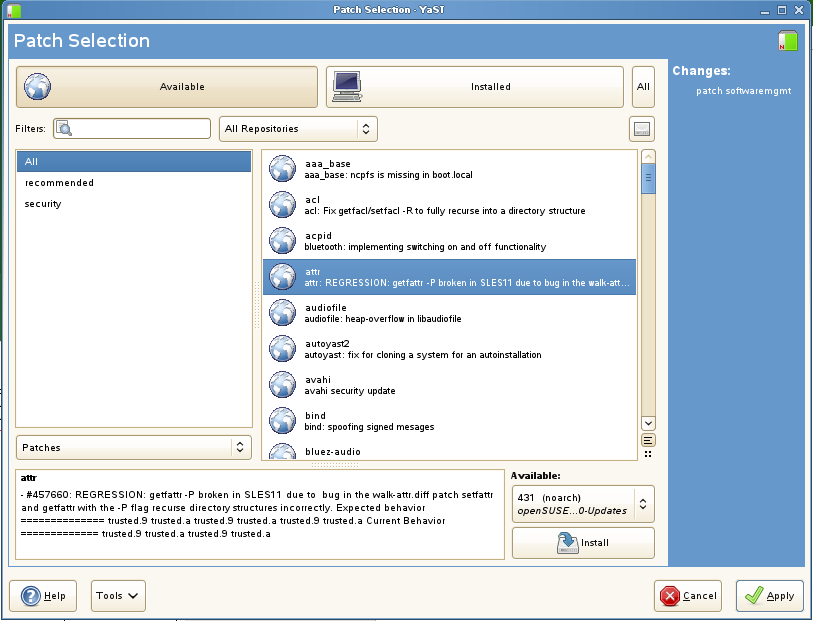
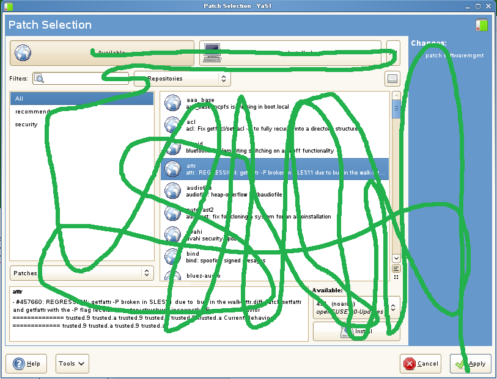

## February
### For fuck's sake

[//p110]: # (https://web.archive.org/web/20171013123338/http://linuxhaters.blogspot.com/2009/01/for-fucks-sake.html)

*Posted Thursday, February 5, 2009 @ 2:10 PM. 367 FLAMES*

If you hang out in the freetard swamp like I sometimes do, you might have heard
the name Abbie Schubert. She’s an unfortunate student who drew the wrath of
thousands of freetards when she blamed Ubuntu for [causing her to drop out of
school][244].

[244]: http://www.wkowtv.com/Global/story.asp?S=9667184

Let’s take a step back and examine this situation.

First off, Dell, YOU HAVE A FREETARD IN YOUR CUSTOMER SERVICE DEPARTMENT. You
just might want to do something about that. I suggest implementing an improved
resume review process to make sure you weed them out.

Secondly, a general rule of selling computers: DON’T PUSH LINUX UNLESS YOUR
CUSTOMER EXPLICITLY ASKS FOR IT.

And for good measure, ask: “Are you sure?”

Actually, try insulting their intelligence: “Are you fucking sure?”. If they
still say yes, then, and only then, *maybe* you can sell it to them. I’d suggest
a full background check. It’s in the interest of your company. You don’t want
another incidient like this on your hands.

Thirdly, this episode once again shows how freetards are just out of touch with
the demands of the general public.

Most people simply don’t know what Linux is. They don’t even know what an
operating system is. If they’re slightly aware, they know there are two kinds of
computers: PCs and Macs. They don’t know that they are essentially the same
hardware with different software on top. They don’t fucking care. They use a CD
provided by their ISP to get online. They use “Word” becuase that’s what
everyone else uses. Word is Word. They don’t fucking care if there’s a
sometimes-compatible-but-most-of-the-time-looks-like-ass equivalent in
OpenOffice. They don’t give a shit about ODF or OOXML or how MS dicks people
over a lot. They don’t want to care. They want to take their class and learn
what they want to.

I feel sorry for you guys, really. All those little bits of frustration and
anger that get built up everytime someone sends you a word document, or god
forbid, a powerpoint with animations and video. It all gets piled up and
unleashed on a poor unsuspecting soul, who, if anything, quite accurately
represents the kinds of users that you can only dream about having.

Why don’t you guys just go back to your Slashdot circle-jerk and leave normal
people alone. Your presence is not appreciated here in the real world.

### Platform of the Web

[//p111]: # (https://web.archive.org/web/20171013081237/http://linuxhaters.blogspot.com/2009/02/platform-of-web.html)

*Posted Friday, February 13, 2009 @ 11:35 PM. 310 FLAMES*

Sorry. Been busy. Not too much time to write right now, but thought I’d mention
[this][245] if you haven’t seen it. Firefox on Wine outperforms native Firefox
on Linux. That’s just awesome guys. What was that about having a lightweight
platform that runs better on less resources?

[245]: http://www.tuxradar.com/content/browser-benchmarks-2-even-wine-beats-linux-firefox

I see a lot of drive-by commentards saying something like I’m spreading FUD on
behalf of MS. The more I think about it, freetards do something similar. It’s
not FUD, it’s the opposite. I’m going to call it COCK. **C**ertainty,
**O**ptimism, **C**onviction, and **K**DE. Certainty, as in you guys are sooo
sure that your OS is the shit, without knowing anything about how real people
use real OSes. Optimism, as in y’all are blindly optimistic when it comes to the
future of your evolving shitpile. Conviction, as in it’s a fucking religion and
y’all go around trying to *convert* people. And KDE, well just cuz KDE sucks,
and y’all try to spread it around to people who don’t care, don’t want it, and
dont’ give a fuck.

So please, for the love of Linus, stop spreading COCK.

### Just let it die, Please

[//p112]: # (https://web.archive.org/web/20160809134105/http://linuxhaters.blogspot.com/2009/02/just-let-it-die-please.html)

*Posted Friday, February 20, 2009 @ 3:16 PM. 641 FLAMES*

Don’t panic everyone! Apparently openSUSE is [not dead yet][246].

[246]: http://lwn.net/Articles/320159/

Seriously though. I wish all SUSE’s would just die. SUSE was born a crack baby,
and has grown up to be a crack smoking crack dealer. Even their stupid lizard
looks like it’s cracked out. I bet the lizard is really just a vessel used for
crack smuggling. Running their distro is more painful than trying to make a call
on an OpenMoko. If I was convicted of murder, and the punishment was solitary
confinement plus the use of a computer running SuSE, I’d just hang myself. And
even worse, If I had to make the choice, I’d run Gentoo before I ran SuSE.

But don’t take it from just from me. Their own developers have a nice list of
[why you should not use SUSE][247]. That’s some really great marketing work
guys.

[247]: http://en.opensuse.org/BrainStorming_Prague

I don’t think Novell never really gave a shit about openSUSE. They just saw what
Redhat did with Fedora, and openSUSE is just a poor “me too” attempt. You know,
Linux is about community or something. So let’s just toss our POS distro over
the wall, and see if some freetards pick it up. Because, like, that would be
totally awesome. The community has infinite free resources, why don’t we harness
some? It’s really easy. You just make a wiki page with really tiny fonts, stick
an “open” in your name, and call it a day.

Now that money is tight, their true colors show. I don’t give a shit about what
any open letter says. It’s the results that matter. And the results say that you
guys are getting your breakfast, lunch, and dinner eaten by RHEL, Feodra,
CentOS, Ubuntu, and Debian. Why don’t you guys just go spend your time porting
your boring management software to distros that actually matter? or work on
something that people want, like C#.

But whatever, if you want to port your crack-addled configuration system to yet
another UI toolkit, be my guest. Now that Qt is LGPL, you can even port things
back! Yay! For those of you that haven’t seen it, here’s the wonderful UI for
picking package updates.

{width=400px}\

And to help you understand that, I’ve added in green, the path that your eye is
supposed to take to make sense of things.

{width=400px}\

So far the only thing I’ve heard that openSUSE is good for is to do development
for SLES, and only if you happen to be a poor Novell employee. Because folks
tell me that you can’t actually do SLES development using SLES. Yay!

Oh, and we can also thank Novell and SuSE for giving money to jackasses like
GregKH. Why is it that the FOSS world attracts so many jackasses? Something
about, how I wrote this free software for free and for freedom, so if you do
anything with it, I at least get to be a totally pain in your ass. Thanks
Novell, for supporting people like GregKH. Why don’t you fund him for another
month so he can write a whole new deck about why Ubuntu sucks. Because that
makes openSUSE just seem that much better. And it’s like, totally awesome for
Linux.

### Driving me insane

[//p113]: # (https://web.archive.org/web/20160817025457/http://linuxhaters.blogspot.com/2009/02/driving-me-insane.html)

*Posted Saturday, February 28, 2009 @ 12:07 PM. 802 FLAMES*

You know what I see a lot lately? Some luser posting some comment somewhere
saying something like:

> Look how far Linux has come.. it used to be that we had no drivers and you had
> to really choose your hardware. Nowadays, most of the drivers are there out of
> the box. This is better than windows!

Another fantastic example of lusers in la-la land.

In case y’all haven’t noticed, the value that a real desktop OS provides is *not
just in the drivers*. Actually, I’d go so far as to saying it’s *mostly* not in
the drivers. Just take a look at the Mac. People are willing to pay oodles of
money for that stuff and it has the fewest drivers of any major platform.

Drivers are only just the beginning. And actually, sometimes they’re the easiest
part. There’s plenty of room for standard Linux fuck-up at higher layers. Audio,
for example. Mostly working alsa drivers you have (and besides, mostly
everything is hda-intel these days), but a userlevel piece to manage sound?
PulseAudio? Yay!

But for some reason y’all like to focus on the drivers. You know why lusers do
that? Because it just happens to be the problem that people notice *first*. Your
install Linux on your machine, your hardware doesn’t fucking show up. That’s
immediate fail. Maybe some day you’ll get to a place where your hardware does
show up. But does that then instantly make Linux as good as Windows or OSX?
Please.

I’m actually excited to see this train-wreck happen. Once y’all have drivers,
the fight will move to the next layer up. And like I said, it’s a lot harder at
that layer. At least hardware doesn’t change, and most of the time, drivers just
expose hardware functions. But providing sane, stable API’s, utilities,
configuration GUI’s, and access to those functions to 3rd party apps with high
levels of integration? Well, if X and PulseAudio are any indication, lusers will
be at this for a loooong time to come.
