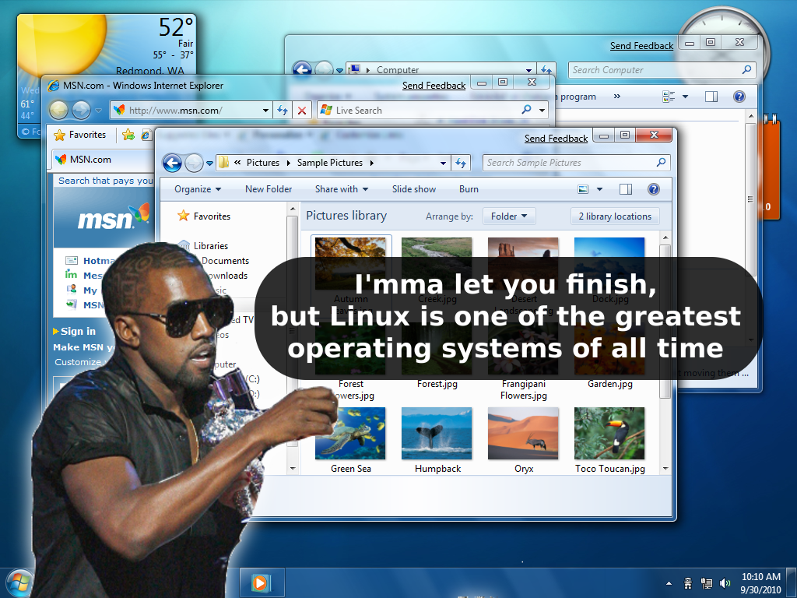

## September
### Here's an idea

[//p124]: # (https://web.archive.org/web/20151026221825/http://linuxhaters.blogspot.com/2009/09/heres-idea.html)

*Posted Monday, September 21, 2009 @ 5:44 PM. 4953 FLAMES*

If you're a freetard, but you need to run Windows at work or something, I've got
an idea for a utility that will keep you true to the cause.

Well, a mockup for it anyways. I call it kanye-freetard-notify:

{width=400px}\
